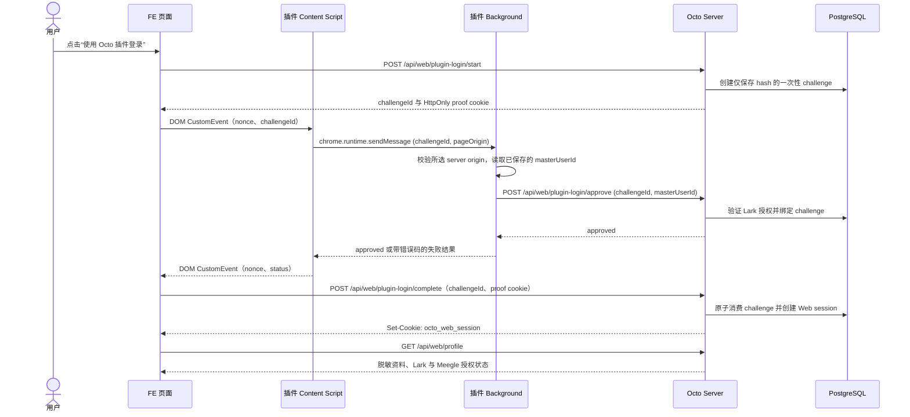

# 当前系统技术对象生命周期

本文档按技术对象整理当前 Octo 系统的生命周期。它用于回答三个问题：

1. 某个对象在哪一层创建，由谁消费？
2. 对象从页面到 server、adapter、平台的流转顺序是什么？
3. 出错时应该先定位 extension、server、adapter 还是 platform？

相关规则见 `../rules/system-boundaries-and-code-rules.md`，当前问题见 `../governance/current-issue-map-2026-06-09.md`。

## 1. 技术对象总览

| 技术对象 | 归属方 | 主要文件 | 当前状态 |
| --- | --- | --- | --- |
| `ExtensionPageConfig` | Server catalog | `server/src/modules/public-config/public-config.controller.ts`, `extension/src/types/automation-actions.ts` | 已存在，但 extension fallback 和本地 action 分支仍会造成漂移 |
| `AutomationActionConfig` / `AutomationActionListItem` | Server catalog, extension UI consumes | `server/src/modules/public-config/public-config.controller.ts`, `extension/src/popup-shared/popup-controller.ts` | server 返回 executor 和 `placements`；popup/sidebar/page DOM 应按 placement 渲染 |
| `PopupPageContext` | Extension | `extension/src/popup-shared/popup-controller.ts`, `extension/src/content-scripts/*`, `extension/src/platform-url.ts` | 页面上下文由 extension 采集，page/action 规则与 server 有重复 |
| `IdentityState` / `masterUserId` | Server identity store, extension cache | `extension/src/background/storage.ts`, `extension/src/popup/runtime.ts`, `server/src/adapters/postgres/resolved-user-store.ts` | 已支持 tab/global fallback，但 action trace 缺少统一身份阶段 |
| `MeegleAuthCredential` | Server auth store, extension auth bridge triggers | `extension/src/content-scripts/meegle.ts`, `extension/src/background/handlers/meegle-auth.ts`, `server/src/modules/meegle-auth/*` | 使用 auth-code bridge；不能把 cookie 发给 server |
| `LarkAuthCredential` | Server auth store, extension OAuth callback bridge | `extension/src/background/handlers/lark-auth.ts`, `extension/src/content-scripts/lark-auth-callback.ts`, `server/src/modules/lark-auth/*` | OAuth session/callback 已存在；live E2E 保护线不足 |
| `LarkBitableRecord` | Lark adapter / server workflow | `server/src/modules/lark-base/lark-base-workflow.service.ts`, `server/src/adapters/lark/lark-client.ts` | server 读取记录并构建 Meegle draft |
| `WorkitemMapping` | Server workflow config | `server/src/modules/lark-base/lark-base-workflow.service.ts`, `server/src/modules/lark-base/lark-base-workflow-config.ts` | 支持 env/config 映射；仍有 hardcoded fallback |
| `ExecutionDraft` | Server workflow | `server/src/validators/agent-output/execution-draft.ts`, `server/src/modules/lark-base/lark-base-workflow.service.ts` | Lark record 到 Meegle create 的中间对象 |
| `MeegleWorkitem` | Meegle platform, adapter wraps | `server/src/adapters/meegle/meegle-client.ts`, `server/src/application/services/meegle-workitem.service.ts` | create/update 已封装；字段可写性主要靠失败后重试 |
| `MeegleFieldMetadata` | Should be server metadata resolver | `server/src/adapters/meegle/meegle-client.ts` | adapter 有 `getFields`/`getWorkitemMeta`，但 workflow 未集中使用 |
| `LarkWriteback` | Server workflow / Lark adapter | `server/src/modules/lark-base/lark-base.service.ts`, `server/src/modules/lark-base/lark-base-workflow.service.ts` | Meegle link 回写到 Lark Base |
| `MeegleLarkPushAction` | Server workflow | `server/src/application/services/meegle-lark-push.service.ts` | 从 Meegle 读 Lark 字段，更新 Lark Base、发消息、回写 Meegle 状态 |
| `MeegleStoryBackBriefAction` | Server workflow | `server/src/application/services/meegle-story-prd-to-simplified.service.ts`, `server/src/modules/meegle-workitem/meegle-story-prd-to-simplified.controller.ts` | 从 Meegle Story Summary 生成 Tech Summary；使用 ACP one-shot、限流、超时和结构化错误 |
| `LarkBugAnalyzeAction` | Server workflow | `server/src/application/services/lark-bug-analyze.service.ts`, `server/src/modules/lark-bug/lark-bug-analyze.controller.ts` | 从 Lark Bug 记录或 Meegle Production Bug 信息生成分析摘要；使用 ACP one-shot、限流、超时和结构化错误 |
| `WorkflowPrompt` | Server PostgreSQL store | `server/src/adapters/postgres/workflow-prompt-store.ts`, `server/src/domain/workflow-prompts.ts` | 按稳定 `key` 存储 workflow prompt 和 `note`；Story 研发Review 使用 `meegle.story.prd_to_simplified`，Lark Bug 分析使用 `lark.bug.analyze` |
| `AcpKimiOneShotRuntime` | Server ACP proxy / adapter | `server/src/application/services/acp-kimi-proxy.service.ts`, `server/src/adapters/kimi-acp/kimi-acp-runtime.ts` | 一次性 ACP runtime；不进入 reusable session registry，prompt 后关闭 |
| `GitHubWorkitemAction` | Extension modal + server workflow | `server/src/modules/github-branch-create/*`, `server/src/controllers/github-reverse-lookup.ts`, `extension/src/popup-shared/*github*` | 依赖 Meegle workitem 字段和 GitHub adapter |
| `ActionRunTrace` | Should be cross-layer contract | docs issue/rules only | 规则已定义，代码尚未统一实现 |

## 2. 分层对象矩阵

这里按 error envelope 的 `layer` 维度整理技术对象。这个矩阵用于排障和代码放置：先判断对象属于哪一层的权威状态，再决定应该改 extension、server、adapter 还是平台 metadata。

| 层级 | 技术对象 | 层级职责 | 不应负责 |
| --- | --- | --- | --- |
| `extension` | `PopupPageContext`, popup state, visible action button, auth trigger state, content-script identity probe, tab-scoped cached `masterUserId` | 采集页面上下文、渲染 UI、触发授权、派发 action、展示结果 | 业务 workflow、平台字段规则、跨平台 mapping、真实 token 持久化 |
| `server` | `ExtensionPageConfig`, `AutomationActionConfig`, `ResolvedUser`, `ExecutionDraft`, `WorkitemMapping`, `WorkflowPrompt`, workflow request/result, `ActionRunTrace`, semantic field mapping, ACP one-shot limiter | action catalog、身份解析、授权检查、业务编排、workflow prompt、错误归一化、测试契约、一次性 ACP 任务控制 | 浏览器 DOM 细节、平台原始字段 shape、直接依赖 extension UI 状态 |
| `adapter` | `MeegleClient` request/response, `LarkClient` request/response, `GitHubClient` request/response, token refresh wrapper, normalized platform error | 第三方 API 封装、请求/响应归一化、平台错误转换、安全日志摘要 | PM 业务决策、popup 行为、跨平台 workflow 编排 |
| `platform` | Lark Base record, Lark message/thread/reaction, Meegle workitem, Meegle field metadata, Meegle auth code, GitHub PR/repo/branch | 外部真实状态、权限限制、字段限制、状态机限制、平台返回错误 | Octo 内部业务语义和错误契约 |

## 3. 跨层归属规则

技术对象不要只看“在哪个文件出现”，要看它的 canonical owner、projection 和允许流转。

| 技术对象 | 权威归属方 | 层内投影 | 允许的流转 | 禁止的使用方式 |
| --- | --- | --- | --- | --- |
| `ExtensionPageConfig` | `server` | `extension` stores and renders it | server catalog -> extension state -> sidebar/action UI | extension 自己维护完整 page/action 规则 |
| `AutomationActionConfig` | `server` | `extension` renders visible button and dispatches executor | server action config -> popup button -> frontend/backend executor | popup 为每个 backend action 硬编码 route 分支 |
| `PopupPageContext` | `extension` | `server` receives sanitized context in action request | tab URL/DOM context -> action request context | server 依赖 extension 内部 UI 状态 |
| `ResolvedUser` / `masterUserId` | `server` | `extension` caches selected identity | identity resolve -> cached masterUserId -> action header/body | extension 自行判断真实账号绑定关系 |
| `MeegleAuthCredential` | `server` | `extension` only triggers auth code acquisition | page auth_code -> server exchange -> token store -> workflow refresh | extension 把 raw cookie/token 发给 server 或持久化真实 token |
| `LarkAuthCredential` | `server` | `extension` tracks OAuth progress/result | OAuth session -> callback -> token store -> workflow refresh | extension 直接持有长期 Lark token 作为 workflow credential |
| `LarkBitableRecord` | `platform` | `adapter` normalizes, `server` interprets | Lark API -> adapter record -> workflow field extraction | extension 直接承担 Lark record 到 Meegle 的业务映射 |
| `WorkitemMapping` | `server` | config/env may provide mapping source | Lark issue type -> server mapping -> `ExecutionDraft` target | adapter 或 extension 决定 workitem type/template |
| `ExecutionDraft` | `server` | adapter consumes converted payload | Lark record -> draft -> Meegle apply -> workitem create | draft 长期承载平台动态 `field_*` 作为业务语义 |
| `MeegleWorkitem` | `platform` | `adapter` normalizes, `server` reads/writes by workflow | Meegle API -> adapter workitem -> workflow decision/update | extension 直接读写 Meegle workitem 业务字段 |
| `MeegleFieldMetadata` | `platform` | `adapter` fetches, `server` resolver turns into semantic field map | platform metadata -> adapter raw response -> server resolver -> validated payload | workflow/popup 散落硬编码 `field_*` |
| `LarkWriteback` | `server` workflow | `adapter` sends Lark update request | workflow result -> Lark adapter update -> platform record state | Meegle adapter 或 extension 直接决定 Lark Base 回写规则 |
| `MeegleLarkPushAction` | `server` | `extension` triggers, adapters execute platform calls | Meegle page action -> server workflow -> Lark/Meegle adapters -> result flags | popup 自行编排 Lark update/message/reaction |
| `MeegleStoryBackBriefAction` | `server` | `extension` triggers, Meegle/Kimi adapters execute platform and ACP calls | Meegle Story page action -> server workflow -> Meegle read -> ACP one-shot -> Meegle Tech Summary update -> result | popup 自行读取 Meegle fields 或调用 ACP |
| `AcpKimiOneShotRuntime` | `server` | ACP adapter subprocess/runtime | workflow limiter -> ACP runtime initialize -> session/new -> prompt -> close runtime | 写入 reusable session registry 或 ownership store |
| `GitHubWorkitemAction` | `server` for workflow, `extension` for modal UX | platform data via Meegle/GitHub adapters | page context -> modal -> server preview/create/lookup -> result | extension 直接解析 Meegle fields 或决定 repo mapping |
| `ActionRunTrace` | `server` contract, initiated by `extension` | all layers append logs with same id | action click -> actionRunId -> server/adapter/platform result -> popup display | 某层吞掉错误，只返回普通 message |

## 4. 文件拆分策略

当前先把所有对象放在同一份 lifecycle 文档中，避免过早拆散上下文。只有满足以下条件时，才把对象拆成独立 lifecycle 文件：

1. 生命周期跨三层以上。
2. 失败会影响真实平台数据或用户授权。
3. 后续会进入实际重构或迁移。
4. 需要单独测试矩阵、seed data、回滚策略或 owner review。

优先拆分候选：

| 候选文件 | 技术对象 | 适合拆分的时机 |
| --- | --- | --- |
| `action-run-trace.md` | `ActionRunTrace` | 开始实现 `actionRunId`、error envelope、跨层日志 |
| `identity-and-auth.md` | `IdentityState`, `MeegleAuthCredential`, `LarkAuthCredential` | 改授权状态、token store、identity fallback 或 live E2E |
| `meegle-field-metadata.md` | `MeegleFieldMetadata` | 开始实现 metadata resolver 或替换硬编码 `field_*` |
| `lark-base-to-meegle-workitem.md` | `LarkBitableRecord`, `WorkitemMapping`, `ExecutionDraft`, `MeegleWorkitem`, `LarkWriteback` | 改 Lark Base 创建 Meegle 或批量创建流程 |
| `meegle-to-lark-push.md` | `MeegleLarkPushAction` | 改 update-lark-and-push |

暂时不拆：

| 技术对象 | 原因 |
| --- | --- |
| `PopupPageContext` | 主要是 extension projection，单独拆会和 page/action 文档重复 |
| `AutomationActionConfig` | 先跟 `ActionRunTrace` 和 page config 放在一起看更清楚 |
| `LarkWriteback` | 当前更适合作为 Lark Base -> Meegle workflow 的一个状态 |
| `GitHubWorkitemAction` | 当前依赖 Meegle metadata 问题，等 metadata resolver 成形后再决定是否拆 |

## 5. 页面配置生命周期

### 技术对象

`ExtensionPageConfig`

```ts
{
  platform;
  pageType;
  matchedRuleId;
  sidebar;
  automationActions: Array<{ key; executor; placements; ... }>;
}
```

### 生命周期

```text
浏览器 tab URL
  -> extension popup/content script 采集当前 URL
  -> extension 调用 server /api/config/page?url=...
  -> server 解析 URL host/path/query
  -> server 返回 platform/pageType/matchedRuleId/sidebar/actions
  -> extension 将 pageConfig 存入 popup 状态
  -> popup/content 渲染 sidebar 与动作
```

### 状态

| 状态 | 含义 | 归属方 |
| --- | --- | --- |
| `unknown` | popup 已打开，但当前 tab/config 尚未解析 | extension |
| `resolved` | server 已返回 `ExtensionPageConfig` | server -> extension |
| `unsupported` | server 无法匹配受支持页面 | server |
| `fallback` | server 配置获取失败，extension 生成本地保守兜底 | extension |
| `stale` | URL 已变化，但 popup/content 仍保留旧配置 | extension |

### 当前风险

- Server has canonical page/action rules, but extension still has local platform detection and fallback.
- Server returns `matchedRuleId`, but downstream action execution does not consistently use it for diagnostics.
- Fallback currently risks enabling UI when server would have rejected the page.

### 代码规则

- New page/action rule starts in server catalog.
- Extension fallback must be conservative.
- Shared URL fixtures should prove server and extension agree on pageType and actions.

## 6. 自动化动作生命周期

### 技术对象

`AutomationActionConfig` on server becomes `AutomationActionListItem` in extension.

### 生命周期

```text
server 定义动作
  -> 纳入 pageConfig.automationActions
  -> extension 按 `placements` 为 popup/sidebar/page DOM 筛选动作
  -> popup 或 page DOM 渲染器将动作映射为可见按钮
  -> 用户点击动作
  -> extension 按 executor 分发
  -> frontend executor 打开本地 UI，或 backend_api executor 调用 server route
  -> server workflow 运行
  -> 结果返回 popup
```

### 状态

| 状态 | 含义 |
| --- | --- |
| `cataloged` | server 已定义动作 key/title/executor |
| `visible` | extension 在 server 允许的 placement 上渲染动作 |
| `blocked` | 缺少必要的授权或上下文 |
| `running` | 用户已点击，动作正在执行 |
| `succeeded` | 动作返回成功结果 |
| `failed` | 动作返回归一化错误 |

### 当前风险

- Popup currently preserves only display fields when producing `PopupFeatureAction`.
- `runFeatureAction(actionKey)` still keeps several frontend action branches while backend API actions are moving toward executor-driven dispatch.
- Server `executor.operation` is not yet the true execution contract.
- Page DOM injection must stay gated by action-level `placements`, not by local DOM guesses alone.

### 代码规则

- Popup should preserve executor and dispatch by executor, not by backend action key.
- Popup/sidebar/page DOM should render only actions whose `placements` include that surface.
- Backend action should not require adding a new popup branch.
- New or refactored cross-layer action runs should generate `actionRunId`.

## 7. 身份与授权生命周期

### 技术对象

- `masterUserId`
- `operatorLarkId`
- `meegleUserKey`
- Lark user token
- Meegle user token
- tab-scoped resolved identity

### 生命周期

```text
popup 初始化
  -> 加载缓存设置与已解析身份
  -> 可用时向 content script 请求 Lark/Meegle 页面身份
  -> 调用 /api/identity/resolve
  -> 全局及按 tab 存储 masterUserId
  -> 检查 Lark 授权状态
  -> 检查 Meegle 授权状态
  -> 动作请求携带 masterUserId
```

### Meegle 授权生命周期

```text
用户位于 Meegle 页面
  -> extension content script 使用页面 session 调用 Meegle BFF auth_code API
  -> background 将 auth_code 发送至 server /api/meegle/auth/exchange
  -> server 用 auth_code 换取 token
  -> server 按 masterUserId + meegleUserKey + baseUrl 存储 token
  -> workflow 调用 Meegle API 前刷新凭据
```

### Lark 授权生命周期

```text
popup 发起 Lark OAuth
  -> extension/background 保存待处理 OAuth 状态
  -> server 创建 OAuth session 并处理 callback
  -> callback 的精确 origin + 路径被识别为支持页面，但不提供自动化动作或侧边栏
  -> callback 页面将结果暴露给 content script
  -> extension 存储 masterUserId 并刷新授权状态
  -> server 为 workflow 调用存储或刷新 Lark token
```

### 独立 FE 插件登录生命周期

```text
FE 创建有效期五分钟的一次性 challenge，并接收 HttpOnly 浏览器 proof cookie
  -> 同源 Octo content script 仅通过 DOM event 接收 challengeId + nonce
  -> background 验证页面 origin 等于所选 SERVER_URL origin
  -> background 使用已存储的 masterUserId 将 challengeId 发送至 server 批准接口
  -> server 验证或刷新既有 Lark 授权，再绑定 challenge
  -> content script 仅向 FE 返回 nonce + approved/failed 状态
  -> FE 携带 HttpOnly 浏览器 proof 完成 challenge，并获得不透明的 Web session
```

### 时序图



桥接层绝不向页面 JavaScript 返回 `masterUserId`、Lark/Meegle token、Meegle user key 或 cookie；此登录路径也不检查 Meegle 授权。

### 失败点

| 失败现象 | 最可能的归属方 |
| --- | --- |
| 无法读取页面身份 | extension/content script |
| 无法解析 `masterUserId` | server identity |
| 缺少 Meegle 绑定 | server identity store |
| 无法获得 auth code | extension 的 Meegle 页面桥接或平台 |
| token 已过期或刷新失败 | server auth service 或平台 |
| 动作调用时缺少 `masterUserId` | extension dispatcher |

### 代码规则

- Extension may trigger auth, but token exchange and persistence stay on server.
- Never send raw browser cookies to server.
- Standalone FE plugin login must use one-time server challenges and an opaque HttpOnly web session; it may reuse existing server-side Lark authorization but must not read it in page JavaScript.
- Action errors must distinguish identity missing, auth missing, token expired, and platform rejected.

## 8. Lark Base 到 Meegle 工作项生命周期

### 技术对象

- `LarkBitableRecord`
- `WorkitemMapping`
- `ExecutionDraft`
- `MeegleApplyInput`
- `MeegleWorkitem`
- `LarkWriteback`

### 生命周期

```text
Lark Base 记录页或批量视图
  -> extension 触发创建或批量创建 workflow
  -> server 校验请求：baseId/tableId/recordId/masterUserId
  -> server 构建已授权的 Lark client
  -> server 读取 LarkBitableRecord
  -> server 提取 Issue 类型
  -> server 解析 WorkitemMapping
  -> server 构建 ExecutionDraft
  -> executeMeegleApply 解析用户与 Meegle token
  -> createWorkitemFromDraft 调用 Meegle 创建 API
  -> 已创建的 Meegle id 形成 Meegle URL
  -> server 将 Meegle 链接回写至 Lark Base
  -> server 返回主工作项与全部工作项
```

### 状态

| 状态 | 含义 |
| --- | --- |
| `record_loaded` | 已读取 Lark 记录 |
| `mapping_resolved` | Issue 类型已匹配一个或多个 Meegle 映射 |
| `draft_built` | 已创建 `ExecutionDraft` |
| `apply_ready` | 身份与 Meegle token 已就绪 |
| `workitem_created` | Meegle 已创建工作项 |
| `writeback_done` | 已将 Meegle 链接回写至 Lark 记录 |
| `failed` | 已返回带工作流错误码的失败结果 |

### 当前风险

- `WorkitemMapping` supports config, but defaults and some fields remain hardcoded.
- `ExecutionDraft.fieldValuePairs` can contain direct Meegle field keys.
- `createWorkitemFromDraft` handles create-time field restriction by retrying after platform error.
- Lark writeback failure happens after Meegle creation, so partial success needs explicit diagnostic handling.

### 代码规则

- New Lark field to Meegle field mapping should go through config or metadata resolver.
- `ExecutionDraft` should move toward semantic field keys before Meegle payload creation.
- When this workflow is refactored, workitem creation and Lark writeback should log the same `actionRunId` and idempotency key.
- Partial success must be visible: workitem created but Lark writeback failed is not the same as create failed.

## 9. Meegle 工作项生命周期

### 技术对象

`MeegleWorkitem`

### 生命周期

```text
ExecutionDraft
  -> 将 fieldValuePairs 转为 Meegle field_value_pairs
  -> 调用 Meegle createWorkitem
  -> adapter 接收 id 或完整对象
  -> 若仅有 id，adapter 获取完整工作项详情
  -> workflow 接收 workitemId 与字段
  -> 后续 updateWorkitem/comment/detail 操作使用 projectKey + workitemTypeKey + workitemId
```

### 状态

| 状态 | 含义 |
| --- | --- |
| `drafted` | server 已具备目标 project/type/template 与字段 |
| `creating` | 已发送创建 API 请求 |
| `created_id_only` | 平台仅返回工作项 id |
| `created_loaded` | 已获取完整工作项详情 |
| `updating` | 已发送字段更新 API 请求 |
| `updated` | 平台已接受更新 |
| `rejected` | 平台拒绝字段、授权或状态变更 |

### 当前风险

- Meegle field writability is discovered at runtime.
- Same business field may map to different `field_key` across story/product bug/tech task.
- Some code paths read fields from flat object, others from nested `fields` / `field_value_pairs`.

### 代码规则

- Workflows should not hardcode `field_*`.
- Adapter should normalize field access shape.
- Metadata resolver should validate create/update payload before platform request.

## 10. Meegle Story 研发Review 生命周期

### 技术对象

- `MeegleStoryBackBriefAction`
- `AcpKimiOneShotRuntime`
- Story semantic fields: `storySummary`, `techSummary`

### 生命周期

```text
Meegle Story 详情页
  -> server page config 返回 story-prd-to-simplified 动作
  -> extension 携带 actionRunId 与页面上下文分发 backend_api executor
  -> server 校验请求并解析 masterUserId
  -> server 刷新 Meegle 凭据
  -> server 获取 Story 工作项详情
  -> workflow 读取 storySummary 语义字段
  -> workflow 获取 Story ACP 并发槽位
  -> ACP proxy 创建一次性 Kimi runtime
  -> ACP runtime initialize -> session/new -> prompt
  -> workflow 收集 agent_message_chunk 文本
  -> ACP proxy 在 finally 中关闭 runtime
  -> workflow 将收集文本写入 techSummary 语义字段
  -> server 返回结果或结构化错误
```

### 状态

| 状态 | 含义 |
| --- | --- |
| `action_visible` | page config 已匹配 Meegle Story 详情页 |
| `request_validated` | DTO 已接受 URL 或 project/type/id 输入 |
| `identity_resolved` | 主用户同时具备 Meegle 与 Lark 身份 |
| `credential_ready` | Meegle 凭据刷新成功 |
| `story_loaded` | 已获取 Meegle Story 详情 |
| `summary_ready` | 已找到非空的 `storySummary` |
| `acp_slot_acquired` | Story ACP 并发限制器已接受本次运行 |
| `acp_running` | one-shot ACP runtime 已初始化并正在生成 |
| `acp_closed` | one-shot runtime 已在生成完成或失败后关闭 |
| `tech_summary_updated` | Meegle 已接受对 `techSummary` 的覆盖写入 |
| `failed` | 工作流已返回类型化错误，未继续执行不安全步骤 |

### 失败契约

| 错误码 | 阶段 | 禁止的操作 |
| --- | --- | --- |
| `ACP_CONCURRENCY_LIMITED` | `adapter.acp.queue` | 启动 ACP 或更新 Meegle |
| `ACP_ANALYSIS_TIMEOUT` | `adapter.acp.prompt` | 更新 Meegle |
| `ACP_INITIALIZE_TIMEOUT` | `adapter.acp.initialize` | 更新 Meegle |
| `ACP_PROCESS_EXITED` | `adapter.acp.process` | 更新 Meegle |
| `ACP_EMPTY_RESULT` | `server.workflow.completed` | 更新 Meegle |

### 代码规则

- Story back-brief uses ACP one-shot, not reusable chat sessions.
- One-shot sessions must not be written to `KimiSessionRegistry` or `AcpKimiSessionOwnershipStore`.
- `chatOneShot()` may emit `session.created` and `done` for diagnostics, but the emitted session id is not resumable.
- Concurrency is server-owned and configured by `STORY_PRD_TO_SIMPLIFIED_ACP_CONCURRENCY_LIMIT` with default `3`.
- Prompt timeout is server-owned and configured by `STORY_PRD_TO_SIMPLIFIED_ACP_TIMEOUT_MS` with default `110000`.
- Only successful, non-empty ACP output can be written to `techSummary`.

## 11. Lark Bug 分析生命周期

### 技术对象

- `LarkBugAnalyzeAction`
- `AcpKimiOneShotRuntime`
- Meegle Production Bug semantic field: `analysisSummary`

### 生命周期

```text
Meegle Production Bug 详情页或 Lark 创建 Meegle Item 的记录页
  -> server page config 返回 lark-bug-analyze 动作
  -> extension 携带 actionRunId 与页面上下文分发 backend_api executor
  -> server 校验请求并解析 masterUserId
  -> server 对 Meegle 输入刷新 Meegle 凭据，或对 Lark 记录输入刷新 Lark 凭据
  -> server 获取 Production Bug 工作项详情或 Lark Base 记录详情
  -> 可用时，Lark 记录输入从 Lark Message Link 的目标消息读取 bug_description
  -> workflow 使用 workflow_prompts 中的 lark.bug.analyze 渲染 prompt
  -> workflow 获取 Lark Bug ACP 并发槽位
  -> ACP proxy 创建一次性 Kimi runtime
  -> workflow 收集 agent_message_chunk 文本
  -> ACP proxy 在 finally 中关闭 runtime
  -> Meegle 输入将收集文本写入 analysisSummary 语义字段
  -> Lark 记录输入将收集文本追加至 Details Description
  -> server 返回结果或结构化错误
```

### 代码规则

- Lark Bug analysis uses ACP one-shot, not reusable chat sessions.
- One-shot sessions must not be written to reusable session ownership state.
- Concurrency is server-owned and configured by `LARK_BUG_ANALYZE_ACP_CONCURRENCY_LIMIT` with default `3`.
- Prompt timeout is server-owned and configured by `LARK_BUG_ANALYZE_ACP_TIMEOUT_MS` with default `110000`.
- The prompt template lives in PostgreSQL `workflow_prompts` under key `lark.bug.analyze`.
- For Meegle input, `analysisSummary` is resolved through production bug fallback config and currently writes to the field used by Lark push message content.
- For Lark record input, the action requires a real Lark Base `recordId`; `wikiRecordId` must not be used as a Bitable record id.
- For Lark record input, `bug_description` is sourced from the `Lark Message Link` target message when available, with record fields as fallback.
- For Lark record input, the action appends the analysis to `Details Description` rather than replacing existing details.

## 12. Meegle 字段元数据生命周期

### 技术对象

`MeegleFieldMetadata`

这是当前缺失、应成为一等生命周期对象的技术对象。

### 目标生命周期

```text
projectKey + workitemTypeKey
  -> resolver 加载 getFields(projectKey)
  -> resolver 加载 getWorkitemMeta(projectKey, workitemTypeKey)
  -> resolver 构建语义字段映射
  -> resolver 记录创建/更新可写性与选项值
  -> workflow 向 resolver 请求语义字段
  -> resolver 返回实际 field_key 或类型化错误
  -> adapter 发送已校验的 payload
```

### 目标状态

| 状态 | 含义 |
| --- | --- |
| `unknown` | 尚未加载元数据 |
| `loaded` | 已获得平台原始元数据 |
| `resolved` | 语义字段已映射为实际 `field_key` |
| `validated_for_create` | 字段允许写入创建 payload |
| `validated_for_update` | 字段允许写入更新 payload |
| `stale` | 平台元数据可能已变化 |
| `rejected` | 字段缺失、不可写、选项缺失或被平台规则拦截 |

### 当前状态

- Adapter already exposes metadata APIs.
- Workflow services do not centrally use metadata before create/update.
- Field IDs are still hardcoded in Lark push, Lark Base workflow, GitHub lookup/branch creation paths.

### 代码规则

- Add metadata fixtures for production bug and story before changing field-heavy flows.
- Introduce semantic names such as `larkRecordLink`, `larkMessageLink`, `larkUpdateMessage`, `larkUpdateStatus`, `system`, `plannedVersion`, `plannedSprint`.
- Treat fallback hardcoded `field_*` as migration config, not business logic.

## 13. Meegle 到 Lark 推送生命周期

### 技术对象

`MeegleLarkPushAction`

### 生命周期

```text
Meegle 工作项详情页
  -> server page config 返回更新/推送或 bug-ticket 动作
  -> extension 动作触发 server endpoint
  -> server 将 masterUserId 解析为 Meegle user key
  -> server 刷新 Meegle 凭据
  -> server 获取 Meegle 工作项详情
  -> server 提取 Lark 记录链接、消息链接、更新消息与更新状态
  -> 若已更新则停止
  -> 有记录链接时更新 Lark Base 状态
  -> 有消息链接时发送 Lark 消息与反应
  -> 将 Meegle 状态字段更新为已更新
  -> 返回动作结果
```

### 状态

| 状态 | 含义 |
| --- | --- |
| `action_visible` | page config 已匹配 Meegle 工作项页面 |
| `credential_ready` | Meegle token 已就绪 |
| `workitem_loaded` | 已获取 Meegle 详情 |
| `fields_extracted` | 已读取 Lark 链接、消息与状态字段 |
| `already_updated` | Meegle 状态表明无需操作 |
| `lark_updated` | Lark Base 状态已改变 |
| `message_sent` | Lark 消息已发送 |
| `reaction_added` | 已添加 Lark 反应 |
| `meegle_status_updated` | Meegle 状态字段已写入 |
| `failed` | 某一步失败，或缺少必要字段 |

### 当前风险

- Uses hardcoded Meegle field IDs for Lark links and update status.
- Missing fields return a plain workflow error string, not a typed platform/metadata error.
- Updating Lark and then failing Meegle status update creates partial success.

### 代码规则

- Field extraction must use metadata resolver or centralized semantic mapping.
- Return flags should stay explicit: `larkBaseUpdated`, `messageSent`, `reactionAdded`, `meegleStatusUpdated`.
- When this workflow is refactored, partial success should include stage and actionRunId.

## 14. GitHub 工作项动作生命周期

### 技术对象

- GitHub PR URL context
- Meegle workitem lookup result
- GitHub branch preview/create request

### 生命周期

```text
GitHub PR 页面或 Meegle 工作项页面
  -> server page config 返回 GitHub 动作或 Meegle 分支动作
  -> extension 打开本地 modal/controller
  -> 需要 Meegle 数据时，server 解析 masterUserId 与 Meegle 授权
  -> server 获取 Meegle 工作项详情或按 PR 反向查找
  -> server 解析 system/version/sprint 等 Meegle 字段
  -> server 将 system 映射为 GitHub repo
  -> server 预览或创建分支
  -> extension 展示结果
```

### 当前风险

- GitHub actions also hardcode Meegle field IDs for system/version/sprint.
- The action starts as `frontend` executor but depends on server-side Meegle/GitHub orchestration.
- Field metadata limitations are shared with Meegle workflows but not yet centralized.

### 代码规则

- Treat GitHub actions as frontend modal plus server workflow, not extension business logic.
- Meegle field resolution should share the same metadata resolver as Lark workflows.

## 15. 动作运行追踪生命周期

### 技术对象

`ActionRunTrace`

该对象目前仍是规则层要求，尚未完整实现。

### 目标生命周期

```text
用户点击动作
  -> extension 创建 actionRunId
  -> popup 记录 extension.action.clicked
  -> background 记录 background.action.dispatch
  -> server 记录 server.action.received
  -> identity/auth/workflow/adapter 日志使用同一 actionRunId
  -> 平台错误被归一化
  -> server 响应返回 actionRunId 与 layer/module/stage/errorCode
  -> popup 展示或导出诊断结果
```

### 异步后端动作扩展

长时间 ACP workflow 可由 server action catalog 将 `execution.mode` 标为 `async`。extension 仅按 catalog 的提交、状态查询与通知文案执行：

```text
extension POST 动作
  -> server 按 actionRunId 持久化排队运行记录
  -> server 立即返回 queued
  -> server 后台 workflow 更新 running/succeeded/failed
  -> extension 轮询配置的状态路由并展示配置的完成通知
```

PR Quick scan / Deep review 的运行状态存于 PostgreSQL `github_pr_review_runs`；PR 评论只在任务成功时创建。

### 目标状态

| 状态 | 含义 |
| --- | --- |
| `started` | 已点击动作 |
| `context_attached` | 已附带页面与身份上下文 |
| `server_received` | backend 已接受请求 |
| `auth_checked` | 必要授权已通过或失败 |
| `workflow_running` | 业务工作流正在运行 |
| `adapter_request_sent` | 已发送平台请求 |
| `platform_response_received` | 已收到平台响应 |
| `completed` | 动作成功 |
| `failed` | 动作返回归一化错误 |

### 代码规则

- For new or refactored cross-layer actions, `actionRunId` should be generated once per user action.
- Every server workflow should accept/pass it, even if optional during migration.
- Error response should identify one responsibility layer, not only a generic message.

## 16. 建议的修复顺序

| 顺序 | 技术对象 | 原因 |
| --- | --- | --- |
| 1 | `ActionRunTrace` | 没有追踪时，后续失败难以定位 |
| 2 | `AutomationActionConfig` executor | 使 server catalog 成为真正的动作来源 |
| 3 | `ExtensionPageConfig` 兜底与 fixture | 降低 extension/server 页面映射漂移 |
| 4 | `MeegleFieldMetadata` 解析器 | 解决动态字段 ID 与可写规则 |
| 5 | `ExecutionDraft` 语义字段 | 将字段 ID 移出 workflow 层 |
| 6 | 真实 E2E 授权 smoke | 确认真实 Lark/Meegle 授权路径 |

## 17. 审查清单

修改任一技术对象时：

1. 编辑前识别归属层。
2. 确认该对象在本文档中有生命周期状态。
3. 在同一生命周期边界新增或更新测试。
4. 若新增或重构跨 extension/server/adapter/platform 的流程，携带 `actionRunId`。
5. 若写入 Meegle 字段，集中将语义字段解析为 `field_key`。
6. 若可能出现部分成功，返回类型化 stage 与结果标志。
