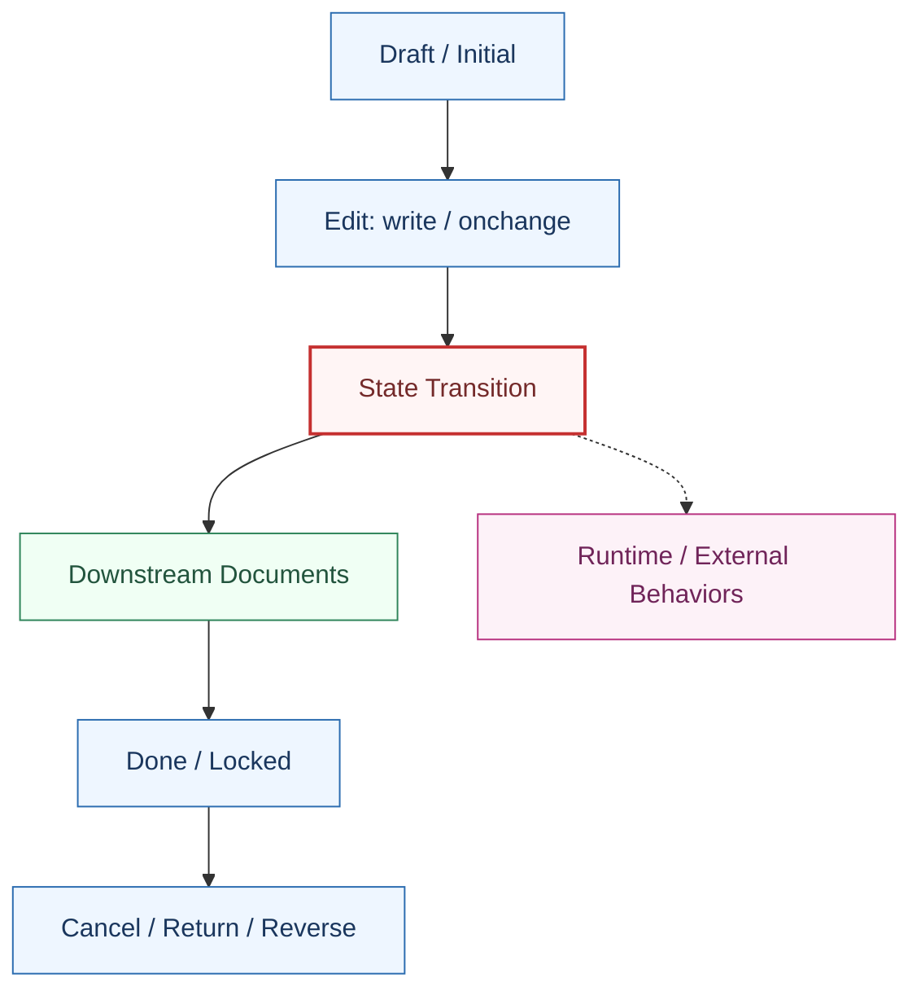

# {model} Lifecycle Map

本文档是 `{model}` 的对象级生命周期地图。它不是代码说明书，而是用于改动前影响分析、AI Coding 上下文、PR Review 和升级评估。

## 1. Summary

### 1.1 Scope

对象：

覆盖业务：

不覆盖：

owner：

最近审阅：

### 1.2 Lifecycle Overview



### 1.3 P0 Nodes

| 节点 | Hook | 风险 | 说明 | 详情 |
| --- | --- | --- | --- | --- |
| TODO | TODO | P0 | TODO | 本文下方章节 |

### 1.4 High-risk Modules

| 模块 | 介入节点 | 风险 | owner | 说明 |
| --- | --- | --- | --- | --- |
| TODO | TODO | P0/P1 | TBD | TODO |

### 1.5 Runtime Behaviors

| 类型 | 名称/key | 影响节点 | 风险 | 清单链接 |
| --- | --- | --- | --- | --- |
| TODO | TODO | TODO | P0/P1 | TODO |

### 1.6 Golden Tests

| 场景 | 覆盖节点 | 测试文件 | 状态 |
| --- | --- | --- | --- |
| TODO | TODO | TODO | missing / partial / covered |

## 2. {node_name}

风险等级：

节点职责：

### 2.1 触发入口

| 入口 | 来源 | 风险 | 说明 |
| --- | --- | --- | --- |
| TODO | UI / API / cron / import / portal / marketplace | P0/P1 | TODO |

### 2.2 参与模块总览

| 顺序 | 模块 | 方法 | super 位置 | 目的 | 是否阻断 | 副作用 | 风险 |
| --- | --- | --- | --- | --- | --- | --- | --- |
| 1 | TODO | TODO | before / after / around / caller | TODO | 是/否 | TODO | P0/P1 |

### 2.3 执行链

```text
入口
  -> before checks
  -> super()
  -> after effects
  -> downstream / async
```

### 2.4 模块分工

| 类型 | 应放模块/位置 | 不应放 |
| --- | --- | --- |
| 阻断类校验 | TODO | TODO |
| 依赖下游对象的逻辑 | TODO | TODO |
| 外部系统同步 | job/queue/integration module | core synchronous hook |

### 2.5 冲突矩阵

| 冲突点 | 涉及模块 | 风险 | 处理建议 |
| --- | --- | --- | --- |
| TODO | TODO | P0/P1 | TODO |

### 2.6 运行时行为

| 类型 | 名称/key | 影响 | 风险 |
| --- | --- | --- | --- |
| TODO | TODO | TODO | P0/P1 |

### 2.7 测试范围

- TODO

### 2.8 修改建议

- TODO

## 3. Size And Split Rules

- 最小版：50-100 行，只填 Summary 和 P0 Nodes。
- 可用版：150-300 行，覆盖主要生命周期节点、模块、配置、测试。
- 成熟版：300-600 行，P0/P1 节点完整，可支撑 review 和升级评估。
- 超过 600 行时，拆分为 `{model}.{node}.md`。
- 单个节点超过 150 行时，拆分为子文档，并在主文档保留摘要链接。

## 4. Content Boundary

应该放：

- 生命周期节点、参与模块、hook、`super()` 位置。
- 触发入口、副作用、运行时配置、server action、automation、cron。
- 模板/报表依赖、权限影响、外部集成、冲突风险、测试范围、修改建议。

不应该放：

- 大段源码。
- 逐行代码解释。
- 全字段说明。
- 长篇业务背景。
- 所有测试实现细节。
- 低风险 compute 的完整描述。
