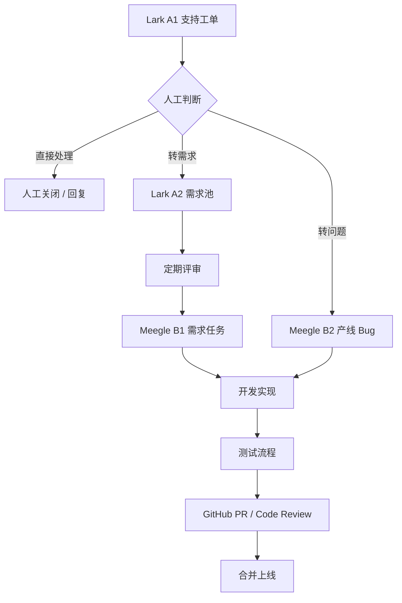
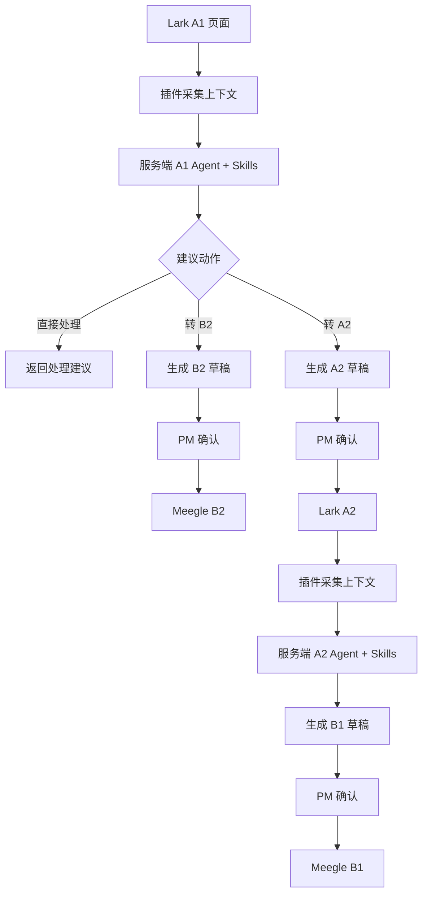

# 业务流程设计

## 现状流程

## 目标流程

核心变化不是改变主流程，而是在关键节点加入“智能分析 + 半自动动作”：

## 核心闭环

### 1. A1 -> B2

- PM 在 Lark A1 页面触发分析
- 系统判断该工单是否应转为 B2
- 系统补全 Bug 标题、描述、复现信息、优先级建议
- PM 确认后创建 Meegle B2

### 2. A2 -> B1

- PM 在 Lark A2 页面触发分析
- 系统对需求做结构化和缺失信息检查
- 系统生成更适合研发执行的 B1 草稿
- PM 确认后创建 Meegle B1

### 3. PM 即时分析

- PM 在插件中选择分析范围
- 系统实时拉取 Lark / Meegle / GitHub 最新数据
- 服务端输出一次性的进度、阻塞、风险、待补全项分析结果

## 关键原则

1. 每次分析或执行前都拉取最新数据。
2. 所有创建动作都先生成草稿，再由 PM 确认。
3. 不做业务数据镜像，不做长期同步表。
4. GitHub 第一阶段用于交付状态分析，不承担 PR 文案生成。
