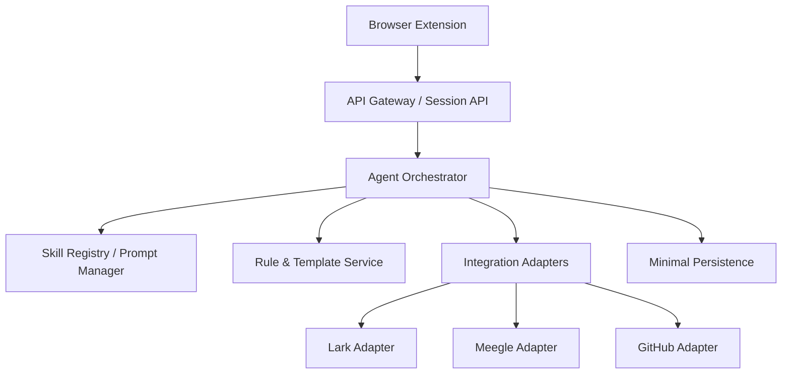

# 总体架构设计

## 1. 设计结论

采用 `浏览器插件 + 服务端智能编排 + 平台适配器` 的轻量架构。

- 插件：触发器 + 上下文采集 + 展示层
- 服务端：Agent / Skill 编排与业务决策中心
- 适配器：对接 Lark / Meegle / GitHub 官方 API
- 存储层：仅保存最小配置与审计信息

## 2. 分层架构

## 3. 插件职责

插件负责：

- 识别当前页面类型
- 识别当前页面用户
- 采集页面上下文
- 在当前登录页面内直接申请 `auth code`
- 触发分析或建单动作
- 展示分析结果、草稿和执行结果

插件不负责：

- 复杂规则判断
- Agent 工作流编排
- 长期业务数据保存
- AI 核心逻辑
- 长期保存平台 token

## 4. 服务端职责

服务端负责：

- 根据场景路由到不同 Agent
- 调用 Skill 完成结构化分析与文案补全
- 实时拉取外部平台数据
- 执行半自动创建或更新动作
- 记录身份映射、规则配置和操作日志
- 管理 Meegle 认证链路与元数据发现
- 接收插件传来的 `auth code` 并完成 token 兑换与刷新

## 5. 实时数据策略

系统不维护外部平台业务镜像。每次请求执行时：

1. 插件上传当前上下文
2. 服务端根据上下文实时拉取最新平台数据
3. Agent 在临时统一模型上分析
4. 返回草稿或分析结果
5. 需要写入时再调用目标平台 API

## 6. 身份设计

- `Lark ID` 是系统主身份
- `Meegle userKey` 和 `GitHub ID` 通过映射表挂到 `Lark ID` 下
- Meegle 认证链路应为：`plugin_id/plugin_secret -> plugin_token -> auth code -> user token / refresh token`
- 正式产品链路采用 `方案 B`：插件直接申请 `auth code`，服务端不接收原始 `Cookie`
- 调用 Meegle open_api 时必须显式携带 `X-USER-KEY`
- 服务端应把 `plugin_token` 视为认证引导凭证，把 `user token` 视为用户侧 API 调用凭证
- 所有操作都记录 `operatorLarkId`

## 7. 架构边界

- 不建设独立 PM 看板页面
- 不做 Lark / Meegle 双向同步引擎
- GitHub 第一阶段仅作为状态分析数据源之一

## 8. Meegle 适配设计更新

根据 `meegle_clients` 当前实现，`Meegle Adapter` 不应只是一个“通用 CRUD 适配器”，而应该拆成更明确的能力层。

### 8.1 认证层

- 管理 `plugin_id / plugin_secret`
- 换取并缓存 `plugin_token`
- 接收插件侧申请好的 `auth code`
- 使用 `plugin_token + auth code` 换取 `user token / refresh token`
- 负责后续 `refresh token` 刷新
- 调用 open_api 时携带用户侧 token 与 `X-USER-KEY`

这里需要特别注意：

- 正式产品路径中，原始 `Cookie` 只存在于浏览器上下文，不进入服务端
- `plugin_token` 主要用于认证交换阶段
- 真正执行 open_api 时，应使用用户态 token，而不是把 `plugin_token` 当作长期业务调用 token
- `meegle_clients` 里的 `auth_cookie` 仅保留为 CLI / 本地调试兜底能力，不是正式产品主路径

### 8.2 目录发现层

- `project / space` 发现
- `workitem_type` 查询
- `field` 查询
- `template / workflow template` 查询
- `workitem meta` 查询

Meegle 建单不是固定字段写死，而是依赖项目、类型、模板和字段元数据，因此创建前必须先走目录发现。

### 8.3 工作项层

- `create_workitem`
- `update_workitem`
- `get_workitem_details`
- `filter_workitems`
- `filter_workitems_across_projects`

这里的关键结论是：

- `B1/B2` 在适配层里应映射为 `Meegle workitem`
- 是否是 `story / bug / task / custom type`，必须由项目配置和真实元数据决定
- `workitem_id` 与展示态 `workitem key` 需要同时保留

### 8.4 工作流 / 任务层

- `get_workflow_details`
- `operate_workflow_node`
- `update_workflow_node`
- `change_workflow_state`
- `create_task`
- `get_tasks`
- `update_task`

因此我们原来“B1/B2 是任务平台”的说法需要收紧为：

> `B1/B2` 是 Meegle 顶层执行工作项；更细粒度的执行动作可能落在 workflow / task 层，而不是顶层 workitem。

### 8.5 协同层

- `comment`
- `attachment`
- `view`
- `bot_join_chat`

这些能力一期不一定全部开放，但适配器边界应该从一开始就预留。

## 9. Meegle 在当前架构中的角色

基于以上事实，当前架构里的 `Meegle Adapter` 应承担三类职责：

1. `Catalog Adapter`
   负责项目、类型、字段、模板、元数据发现
2. `Execution Adapter`
   负责 workitem / workflow / task 的创建、读取、更新
3. `Collaboration Adapter`
   负责评论、附件、视图与机器人相关扩展能力

服务端 Agent 的输出也应从泛化的“执行草稿”调整为更贴近 Meegle 的结构化草稿：

- `project_key`
- `workitem_type_key`
- `name`
- `template_id`
- `field_value_pairs`
- 可选 `workflow_action`
