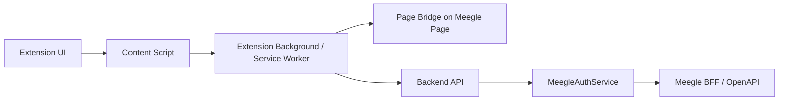
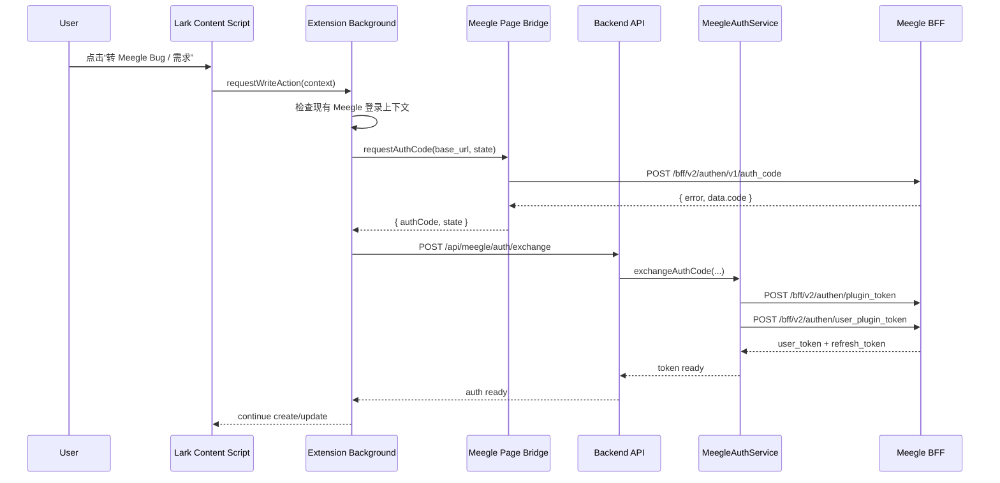
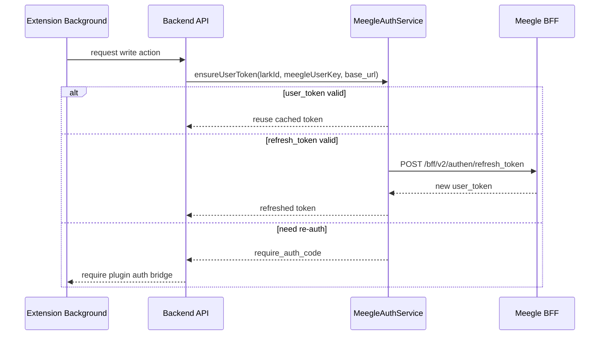

# Meegle 轻认证桥设计

## 1. 设计目标

本设计用于把 `方案 B` 落成可实现的前后端协作方式：

- 浏览器插件在当前登录上下文里直接申请 `auth code`
- 服务端只接收 `auth code`
- 服务端负责 `plugin_token -> user_token / refresh_token`
- 原始 `Cookie` 不进入服务端长期配置

这层设计本质上是一个轻认证桥，不是完整 OAuth 平台，也不是独立登录系统。

## 2. 设计结论

正式产品采用以下链路：

1. 用户在 Lark A1 / A2 或 Meegle 页面触发需要写入 Meegle 的动作
2. 插件判断当前是否已有可用的 Meegle 登录上下文
3. 插件在 Meegle 当前登录页面直接请求 `auth code`
4. 插件把 `auth code`、`base_url`、当前 `Lark ID`、已绑定 `meegleUserKey` 发送给服务端
5. 服务端用 `plugin_id / plugin_secret` 获取 `plugin_token`
6. 服务端用 `plugin_token + auth code` 换 `user_token / refresh_token`
7. 服务端缓存用户态 token，并继续执行创建 / 更新 workitem

## 3. 组件划分

### 3.1 Extension UI

职责：

- 在 Lark / Meegle 页面展示动作按钮
- 展示“正在申请授权”“需要登录 Meegle”“授权失效”等状态
- 展示错误和恢复建议

### 3.2 Content Script

职责：

- 识别当前页面类型
- 采集页面上下文
- 触发背景进程执行 `ensureMeegleSession`
- 接收执行结果并更新 UI

### 3.3 Background / Service Worker

职责：

- 作为插件内部总线
- 管理 Lark 页与 Meegle 页之间的消息路由
- 查找已有 Meegle tab
- 必要时打开 Meegle helper tab
- 只在内存中暂存一次性的 `auth code`
- 调用服务端接口完成 token 兑换

### 3.4 Page Bridge

职责：

- 运行在 Meegle 登录页面上下文
- 使用当前页面登录态直接调用 `POST /bff/v2/authen/v1/auth_code`
- 只把 `{ code, state }` 返回给插件

推荐原因：

- 不需要把原始 `Cookie` 暴露给服务端
- 不要求插件长期保存登录态
- 最贴近当前真实接口形态

### 3.5 Backend API + MeegleAuthService

职责：

- 接收插件上传的 `auth code`
- 获取 `plugin_token`
- 兑换并缓存 `user_token / refresh_token`
- 维护后续刷新逻辑
- 对业务动作返回“已可写入 Meegle”的结果

## 4. 两类触发场景

### 4.1 在 Lark 页面触发 A1 / A2 写入 Meegle

这是主场景。

处理方式：

1. Lark 页面插件按钮触发写入动作
2. Background 检查是否已有同租户 `base_url` 的 Meegle 活跃 tab
3. 如果有，向该 tab 的 Page Bridge 请求 `auth code`
4. 如果没有，打开一个 Meegle helper tab，并在该 tab 完成 `auth code` 申请
5. 拿到 `auth code` 后立即调用服务端兑换 token
6. 服务端返回“认证就绪”，再继续建单或更新

### 4.2 在 Meegle 页面直接触发

这是更简单的路径。

处理方式：

1. 当前页就是可用登录上下文
2. Content Script 直接调用本页 Page Bridge
3. 拿到 `auth code` 后交给 Background
4. Background 调服务端完成兑换

## 5. 推荐时序

### 5.1 首次写入时序

### 5.2 后续复用时序

## 6. 插件内部接口建议

### 6.1 UI -> Background

`requestMeegleWrite(context)`

请求体建议：

- `operatorLarkId`
- `sourcePlatform`
- `sourceRecordId`
- `targetAction`
- `baseUrl`
- `meegleUserKey`

### 6.2 Background -> Meegle Page Bridge

`requestAuthCode(state, pluginId, baseUrl)`

返回值建议：

- `authCode`
- `state`
- `issuedAt`

### 6.3 Background -> Backend

`POST /api/meegle/auth/exchange`

请求体建议：

- `operatorLarkId`
- `meegleUserKey`
- `baseUrl`
- `authCode`
- `state`

响应建议：

- `status`
- `tokenStatus`
- `expiresAt`
- `needRebind`

### 6.4 服务端业务接口

在完成 `auth exchange` 之后，再进入：

- `POST /api/meegle/workitems/create-from-a1`
- `POST /api/meegle/workitems/create-from-a2`
- `POST /api/meegle/analysis/run`

建议不要把“认证兑换”和“业务写入”强耦合成一个黑盒接口，否则异常处理会很难做。

## 7. 服务端数据模型建议

### 7.1 MeegleUserCredential

建议字段：

- `larkId`
- `meegleUserKey`
- `baseUrl`
- `userToken`
- `refreshToken`
- `userTokenExpiresAt`
- `lastAuthAt`
- `lastRefreshAt`
- `credentialStatus`

### 7.2 AuthAttemptLog

建议字段：

- `operatorLarkId`
- `baseUrl`
- `state`
- `result`
- `errorCode`
- `createdAt`

## 8. 异常处理策略

### 8.1 没有可用 Meegle 页面上下文

插件提示：

- `未检测到可用的 Meegle 登录页面，正在打开授权页`

如果 helper tab 打开失败，则回退为人工登录引导。

### 8.2 Meegle 未登录

插件提示：

- `当前 Meegle 未登录，请先完成登录后再继续`

### 8.3 auth code 失效

服务端返回 `require_auth_code`，插件重新拉起 Page Bridge 申请一次新的 `auth code`。

### 8.4 user_key 未绑定

服务端不执行写入，只提示：

- `当前 Lark 账号尚未绑定 Meegle userKey`

### 8.5 refresh_token 刷新失败

服务端清理失效 token，并要求插件重新获取 `auth code`。

## 9. 安全边界

必须遵守：

1. 原始 `Cookie` 不上传服务端。
2. 插件不在持久化存储中保存 `auth code`。
3. `auth code` 只在单次认证链路里短暂存在。
4. 服务端只保存 `user_token / refresh_token`，不保存浏览器原始登录态。
5. 每次认证日志都绑定 `operatorLarkId` 和 `meegleUserKey`。

## 10. 与 `meegle_clients` 的关系

`meegle_clients` 目前保留了 `auth_cookie` 配置能力，但在整体产品架构里应被视为：

- 本地 CLI 调试能力
- 脚本排查能力
- 非正式产品主路径

正式产品仍应以浏览器插件直接申请 `auth code` 为准。

## 11. 一期落地建议

第一期推荐这样做：

1. 先支持“从已有 Meegle tab 申请 `auth code`”
2. 再补“自动打开 helper tab”的兜底能力
3. 服务端先支持 token 兑换与刷新
4. B1 / B2 建单动作统一复用这条认证桥

这样可以先跑通主链路，再逐步补齐更完整的插件体验。
