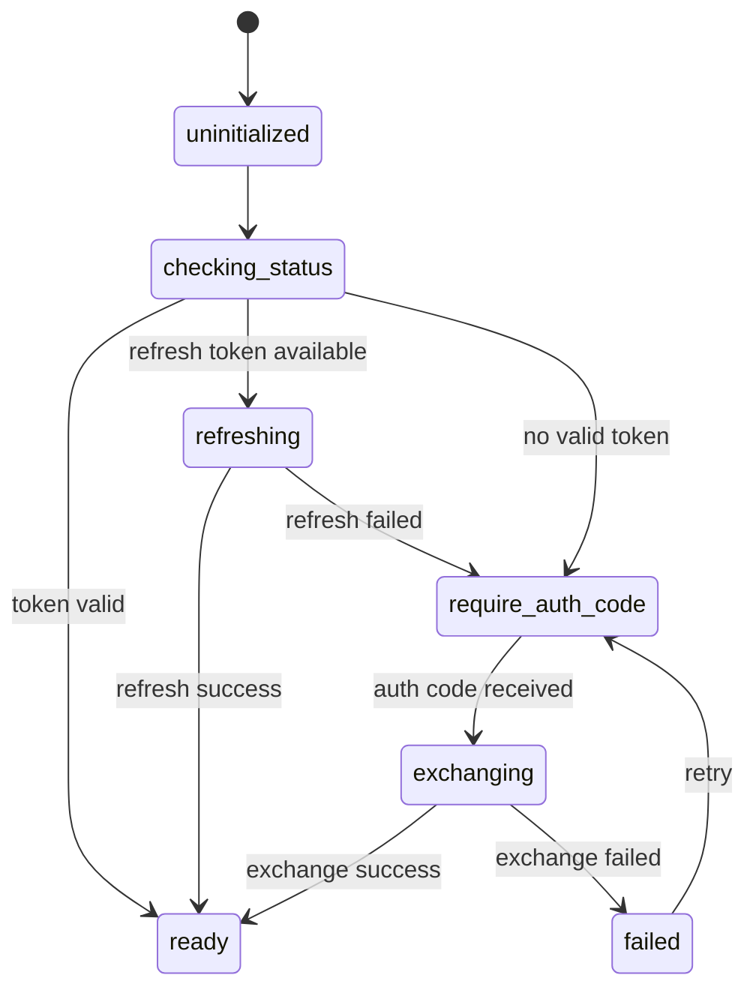
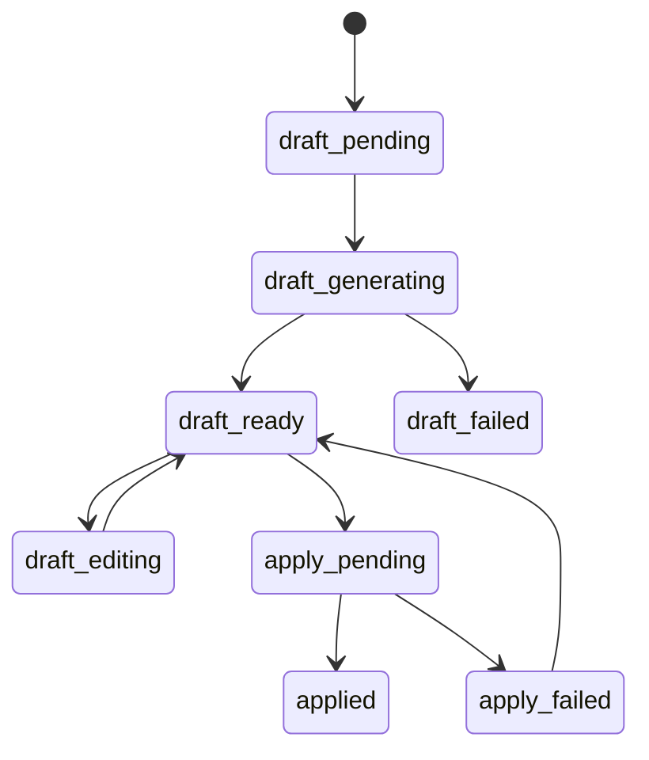
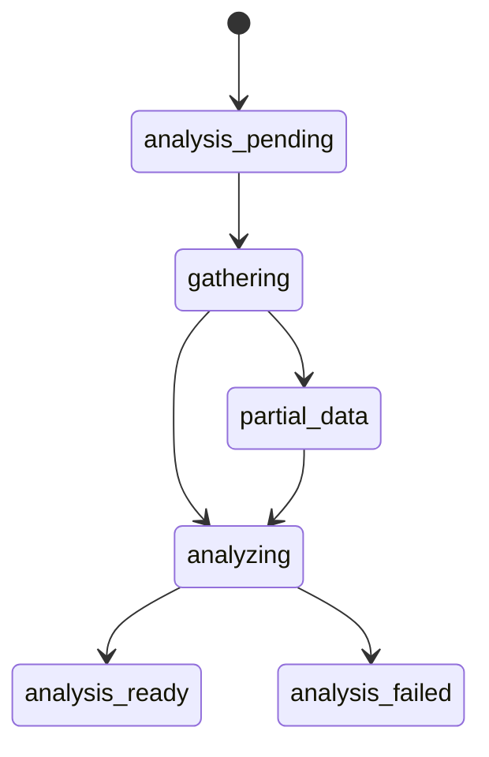

# 字段 Schema 与状态机

## 1. 设计目标

本文件用于补足 [插件消息协议与 API Schema](/home/uynil/projects/tw-itdog/docs/it-pm-assistant/11-extension-message-and-api-schema.md) 中未展开的细节，重点定义：

- 通用字段 contract
- 核心 request / response 的必填与可选字段
- 错误码目录
- 认证、草稿、执行三类状态机

目标是让后续插件和服务端实现可以直接按字段约定落地，不再停留在“接口名对齐但字段含义模糊”的阶段。

## 2. 通用字段规范

## 2.1 基础命名规则

- JSON 字段统一使用 `camelCase`
- 枚举值统一使用 `snake_case` 或 `upper_snake_case`，同一字段内保持一致
- 时间统一使用 ISO 8601，例如 `2026-03-20T12:00:00+08:00`
- ID 字段优先使用字符串，不依赖前端对数值精度处理

## 2.2 通用 Envelope Schema

### RequestEnvelope

```json
{
  "requestId": "req_20260320_001",
  "action": "itdog.a1.create_b2_draft",
  "payload": {},
  "meta": {
    "pageType": "lark_a1",
    "clientVersion": "0.1.0",
    "sentAt": "2026-03-20T12:00:00+08:00"
  }
}
```

字段定义：

| 字段 | 类型 | 必填 | 说明 |
|------|------|------|------|
| `requestId` | `string` | 是 | 一次请求唯一 ID |
| `action` | `string` | 是 | 协议动作名 |
| `payload` | `object` | 是 | 动作参数 |
| `meta` | `object` | 否 | 客户端上下文 |
| `meta.pageType` | `string` | 否 | 当前页面类型 |
| `meta.clientVersion` | `string` | 否 | 插件版本 |
| `meta.sentAt` | `string` | 否 | 客户端发送时间 |

### ResponseEnvelope

```json
{
  "requestId": "req_20260320_001",
  "ok": true,
  "status": "ready",
  "data": {},
  "error": null
}
```

字段定义：

| 字段 | 类型 | 必填 | 说明 |
|------|------|------|------|
| `requestId` | `string` | 是 | 原请求 ID |
| `ok` | `boolean` | 是 | 是否成功 |
| `status` | `string` | 是 | 当前状态 |
| `data` | `object|null` | 是 | 成功结果 |
| `error` | `object|null` | 是 | 失败信息 |

### ErrorObject

```json
{
  "errorCode": "MEEGLE_AUTH_REQUIRED",
  "errorMessage": "当前需要重新获取授权码",
  "recoverable": true,
  "retryAfterSeconds": 0,
  "details": {
    "baseUrl": "https://project.larksuite.com"
  }
}
```

字段定义：

| 字段 | 类型 | 必填 | 说明 |
|------|------|------|------|
| `errorCode` | `string` | 是 | 机器可识别错误码 |
| `errorMessage` | `string` | 是 | 用户可读描述 |
| `recoverable` | `boolean` | 是 | 是否可恢复 |
| `retryAfterSeconds` | `number` | 否 | 建议重试等待时间 |
| `details` | `object` | 否 | 扩展上下文 |

## 3. 页面上下文 Schema

### PageContext

```json
{
  "pageType": "lark_a1",
  "url": "https://example.feishu.cn/base/...",
  "title": "支持工单",
  "baseId": "app_xxx",
  "tableId": "tbl_A1",
  "recordId": "rec_xxx",
  "workspaceHint": "team_a"
}
```

字段定义：

| 字段 | 类型 | 必填 | 说明 |
|------|------|------|------|
| `pageType` | `string` | 是 | `lark_a1` / `lark_a2` / `meegle_workitem` / `github_pr` |
| `url` | `string` | 是 | 当前页面 URL |
| `title` | `string` | 否 | 页面标题 |
| `baseId` | `string` | 条件必填 | Lark Base 场景 |
| `tableId` | `string` | 条件必填 | Lark 表格场景 |
| `recordId` | `string` | 条件必填 | 当前记录 ID |
| `workspaceHint` | `string` | 否 | 页面级工作空间提示 |

## 4. 身份与认证字段 Schema

### IdentityBinding

```json
{
  "operatorLarkId": "ou_xxx",
  "mappingStatus": "bound",
  "meegleUserKey": "user_xxx",
  "githubId": "octocat"
}
```

枚举：

- `mappingStatus`
  - `bound`
  - `partial`
  - `unbound`

### MeegleAuthEnsureRequest

```json
{
  "operatorLarkId": "ou_xxx",
  "meegleUserKey": "user_xxx",
  "baseUrl": "https://project.larksuite.com"
}
```

字段约束：

| 字段 | 类型 | 必填 | 说明 |
|------|------|------|------|
| `operatorLarkId` | `string` | 是 | 当前操作者主身份 |
| `meegleUserKey` | `string` | 是 | 已绑定的 Meegle 用户标识 |
| `baseUrl` | `string` | 是 | 当前 Meegle 租户地址 |

### MeegleAuthExchangeRequest

```json
{
  "requestId": "req_20260320_001",
  "operatorLarkId": "ou_xxx",
  "meegleUserKey": "user_xxx",
  "baseUrl": "https://project.larksuite.com",
  "authCode": "34f3d067e6eb42fa89106c101ebba3d8",
  "state": "state_req_20260320_001"
}
```

字段约束：

| 字段 | 类型 | 必填 | 说明 |
|------|------|------|------|
| `requestId` | `string` | 是 | 认证链路请求 ID |
| `operatorLarkId` | `string` | 是 | 操作者主身份 |
| `meegleUserKey` | `string` | 是 | 已绑定的用户 key |
| `baseUrl` | `string` | 是 | 租户地址 |
| `authCode` | `string` | 是 | 插件侧申请的授权码 |
| `state` | `string` | 是 | 防串线 state |

### MeegleAuthStatusResponse

```json
{
  "tokenStatus": "ready",
  "credentialStatus": "active",
  "expiresAt": "2026-03-20T14:00:00+08:00",
  "needRebind": false
}
```

枚举：

- `tokenStatus`
  - `ready`
  - `refreshing`
  - `require_auth_code`
  - `expired`
- `credentialStatus`
  - `active`
  - `invalid`
  - `missing_binding`

## 5. 草稿与执行字段 Schema

### DraftTarget

```json
{
  "projectKey": "PROJ1",
  "workitemTypeKey": "bug",
  "templateId": 123
}
```

### FieldValuePair

```json
{
  "fieldKey": "description",
  "fieldValue": "支付页白屏，影响线上用户"
}
```

字段约束：

| 字段 | 类型 | 必填 | 说明 |
|------|------|------|------|
| `fieldKey` | `string` | 是 | Meegle 字段 key |
| `fieldValue` | `string|number|boolean|array|object|null` | 是 | 字段值 |

### ExecutionDraft

```json
{
  "draftId": "draft_b2_001",
  "draftType": "b2",
  "sourceRef": {
    "sourcePlatform": "lark_a1",
    "sourceRecordId": "recA1_001"
  },
  "target": {
    "projectKey": "PROJ1",
    "workitemTypeKey": "bug",
    "templateId": 123
  },
  "name": "支付页白屏",
  "fieldValuePairs": [],
  "ownerUserKeys": ["user_xxx"],
  "missingMeta": [],
  "needConfirm": true
}
```

枚举：

- `draftType`
  - `b1`
  - `b2`

### ApplyDraftRequest

```json
{
  "requestId": "req_20260320_002",
  "draftId": "draft_b2_001",
  "operatorLarkId": "ou_xxx",
  "sourceRecordId": "recA1_001",
  "idempotencyKey": "idem_req_20260320_002",
  "confirmedDraft": {
    "name": "支付页白屏",
    "fieldValuePairs": []
  }
}
```

## 6. A1 / A2 / PM 分析响应 Schema

### A1AnalyzeResponse

```json
{
  "summary": "该工单更适合进入产线 Bug",
  "decision": "to_b2",
  "missingFields": ["environment", "repro_steps"],
  "riskLevel": "medium",
  "nextActions": ["补充环境信息", "生成 B2 草稿"]
}
```

枚举：

- `decision`
  - `direct_handle`
  - `to_b2`
  - `to_a2`
  - `need_more_info`
- `riskLevel`
  - `low`
  - `medium`
  - `high`

### A2AnalyzeResponse

```json
{
  "summary": "需求描述可进入研发评审，但缺少非范围说明",
  "readiness": "needs_refine",
  "missingFields": ["out_of_scope"],
  "suggestedSplit": [],
  "nextActions": ["补充非范围", "生成 B1 草稿"]
}
```

枚举：

- `readiness`
  - `ready_for_b1`
  - `needs_refine`
  - `blocked`

### PMAnalysisResponse

```json
{
  "summary": "本周期有 3 个事项阻塞超过 5 天",
  "blockers": [],
  "staleItems": [],
  "missingDescriptionItems": [],
  "suggestedActions": []
}
```

## 7. 错误码表

## 7.1 身份相关

| 错误码 | 含义 | recoverable | 推荐动作 |
|--------|------|-------------|----------|
| `IDENTITY_NOT_FOUND` | 未识别到当前用户 | 是 | 重新采集页面身份 |
| `IDENTITY_NOT_BOUND` | 未建立平台映射 | 是 | 引导绑定 `meegleUserKey` |
| `IDENTITY_CONFLICT` | 页面识别结果与绑定信息冲突 | 否 | 人工确认身份 |

## 7.2 Meegle 认证相关

| 错误码 | 含义 | recoverable | 推荐动作 |
|--------|------|-------------|----------|
| `MEEGLE_AUTH_REQUIRED` | 当前需要重新授权 | 是 | 重新申请 `auth code` |
| `MEEGLE_NOT_LOGGED_IN` | Meegle 页面未登录 | 是 | 引导登录 |
| `MEEGLE_AUTH_CODE_EXPIRED` | `auth code` 已失效 | 是 | 重新拉起认证桥 |
| `MEEGLE_AUTH_CODE_STATE_MISMATCH` | `state` 校验失败 | 是 | 重新发起认证 |
| `MEEGLE_TOKEN_REFRESH_FAILED` | 刷新失败 | 是 | 清 token 后重新授权 |
| `MEEGLE_BASE_URL_UNAVAILABLE` | 当前租户地址不可用 | 否 | 检查配置 |

## 7.3 Meegle 元数据 / 执行相关

| 错误码 | 含义 | recoverable | 推荐动作 |
|--------|------|-------------|----------|
| `MEEGLE_META_MISSING` | 项目或字段元数据不足 | 是 | 重新拉取 meta |
| `MEEGLE_TEMPLATE_INVALID` | 模板无效 | 是 | 切换模板 |
| `MEEGLE_CREATE_FAILED` | 创建 workitem 失败 | 是 | 展示失败详情并重试 |
| `MEEGLE_UPDATE_FAILED` | 更新 workitem 失败 | 是 | 重试或人工处理 |
| `MEEGLE_DUPLICATE_REQUEST` | 命中了幂等或重复建单保护 | 否 | 展示已存在结果 |

## 7.4 来源数据 / AI 相关

| 错误码 | 含义 | recoverable | 推荐动作 |
|--------|------|-------------|----------|
| `A1_RECORD_NOT_FOUND` | A1 记录不存在 | 否 | 刷新页面 |
| `A2_RECORD_NOT_FOUND` | A2 记录不存在 | 否 | 刷新页面 |
| `PARTIAL_DATA_UNAVAILABLE` | 跨平台读取不完整 | 是 | 降级分析 |
| `SCHEMA_VALIDATION_FAILED` | AI 输出未通过校验 | 是 | 重跑 agent 或人工编辑 |

## 8. 状态机

## 8.1 认证状态机



状态定义：

- `uninitialized`: 尚未检查认证状态
- `checking_status`: 正在检查服务端 token 状态
- `refreshing`: 正在刷新 `user_token`
- `require_auth_code`: 需要插件重新获取 `auth code`
- `exchanging`: 正在兑换 token
- `ready`: 可直接调用 Meegle
- `failed`: 当前链路失败

## 8.2 草稿状态机



状态定义：

- `draft_pending`: 尚未生成草稿
- `draft_generating`: 正在生成
- `draft_ready`: 草稿已可确认
- `draft_editing`: 用户正在编辑
- `apply_pending`: 正在正式写入
- `applied`: 已创建成功
- `apply_failed`: 正式写入失败

## 8.3 PM 分析状态机



状态定义：

- `analysis_pending`: 等待开始
- `gathering`: 正在拉取多平台数据
- `partial_data`: 部分平台数据不可用
- `analyzing`: agent 正在生成报告
- `analysis_ready`: 报告已可展示
- `analysis_failed`: 分析失败

## 9. 一期建议校验规则

建议在服务端做以下基础校验：

1. `requestId` 不允许为空
2. 所有 `apply` 请求必须带 `idempotencyKey`
3. `authCode` 必须和 `state` 同时出现
4. `baseUrl` 必须和当前租户白名单匹配
5. `draft.target.projectKey` 和 `draft.target.workitemTypeKey` 必须存在
6. `fieldValuePairs` 必须是数组，即使为空也返回 `[]`
7. 所有错误响应都必须带 `errorCode`

## 10. 与实现的对应建议

可以把这份文档直接映射为三层代码定义：

1. 插件侧 `types.ts`
2. 服务端 `dto / schema` 定义
3. Agent 输出校验 schema

这样后续新增字段时，可以始终围绕同一套 contract 演进。
