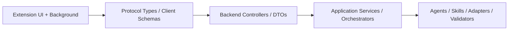

# 代码结构与校验设计

## 1. 设计目标

本文件把前面的协议和 schema 继续落到“代码该怎么组织”的层面，回答 3 个问题：

1. 插件端类型和消息处理该放在哪些文件
2. 服务端 DTO / schema / handler 该怎么拆
3. Agent 输出校验应该落在哪一层

这份设计的目标不是替代实现计划，而是先把主要模块边界定清楚，方便后面拆任务、并行开发和审查。

## 2. 总体分层

建议整体按四层组织：



含义：

- 插件侧负责采集、触发、展示
- 协议层负责 request / response 类型定义
- 服务端接口层负责 DTO 校验和路由
- 应用层负责业务编排
- 领域层负责 Agent、Skill、平台适配器和执行校验

## 3. 插件端代码结构建议

## 3.1 文件职责

建议插件端至少拆出以下模块：

### `src/types/protocol.ts`

职责：

- 定义所有插件内部消息 `action`
- 定义 `RequestEnvelope / ResponseEnvelope`
- 定义 `ErrorObject`

### `src/types/context.ts`

职责：

- 定义 `PageContext`
- 定义 `IdentityBinding`
- 定义当前页面识别结果类型

### `src/types/meegle.ts`

职责：

- 定义 `MeegleAuthEnsureRequest`
- 定义 `MeegleAuthStatusResponse`
- 定义 `ExecutionDraft / DraftTarget / FieldValuePair`

### `src/background/router.ts`

职责：

- 按 `action` 分发消息
- 调用对应 handler

### `src/background/handlers/`

建议子文件：

- `identity.ts`
- `meegle-auth.ts`
- `a1.ts`
- `a2.ts`
- `pm-analysis.ts`

每个 handler 只负责：

- 入参解析
- 调用服务端
- 整理统一响应

### `src/page-bridge/meegle-auth.ts`

职责：

- 在 Meegle 页面上下文中请求 `auth_code`
- 不负责 token 兑换

## 3.2 插件端最小类型集

建议第一批固定以下类型：

- `ProtocolAction`
- `RequestEnvelope<TPayload>`
- `ResponseEnvelope<TData>`
- `ErrorObject`
- `PageContext`
- `IdentityBinding`
- `MeegleAuthEnsureRequest`
- `MeegleAuthStatusResponse`
- `ExecutionDraft`

这样能让 UI、Content Script、Background 之间先用同一套 contract。

## 4. 服务端代码结构建议

## 4.1 接口层

建议按业务域拆模块，而不是把所有接口堆在一个控制器里。

### `src/modules/identity/`

职责：

- `POST /api/identity/resolve`
- DTO 校验
- 返回统一身份绑定结果

建议文件：

- `identity.controller.ts`
- `identity.dto.ts`
- `identity.service.ts`

### `src/modules/meegle-auth/`

职责：

- `POST /api/meegle/auth/exchange`
- `POST /api/meegle/auth/status`
- token 兑换 / 刷新 / 状态判断

建议文件：

- `meegle-auth.controller.ts`
- `meegle-auth.dto.ts`
- `meegle-auth.service.ts`
- `meegle-auth.repository.ts`

### `src/modules/a1/`

职责：

- `POST /api/a1/analyze`
- `POST /api/a1/create-b2-draft`
- `POST /api/a1/apply-b2`

### `src/modules/a2/`

职责：

- `POST /api/a2/analyze`
- `POST /api/a2/create-b1-draft`
- `POST /api/a2/apply-b1`

### `src/modules/pm-analysis/`

职责：

- `POST /api/pm/analysis/run`

## 4.2 应用编排层

建议单独抽一层 `application services`，不要把所有编排压进 controller。

建议服务：

- `IdentityResolutionService`
- `MeegleCredentialService`
- `A1WorkflowService`
- `A2WorkflowService`
- `PMAnalysisService`

职责：

- 调用 adapter / agent / validator
- 组织一次完整工作流
- 返回接口层可直接输出的结果

## 4.3 平台适配与 AI 领域层

建议拆成：

- `adapters/lark/`
- `adapters/meegle/`
- `adapters/github/`
- `agents/`
- `skills/`
- `validators/`

其中：

- `adapters/` 负责外部平台 API
- `agents/` 负责场景编排
- `skills/` 负责具体分析能力
- `validators/` 负责 schema 校验和错误归一化

## 5. DTO / Schema / Domain Model 边界

建议明确 3 套对象，不要混用：

### 5.1 DTO

面向 HTTP 输入输出。

特点：

- 字段名稳定
- 贴近 API contract
- 校验严格

例如：

- `MeegleAuthExchangeRequestDto`
- `A1AnalyzeRequestDto`
- `ApplyB2RequestDto`

### 5.2 Domain Model

面向业务编排和 Agent。

特点：

- 可以做适度抽象
- 不需要完全等同 HTTP 字段

例如：

- `IdentityBinding`
- `ExecutionDraft`
- `AnalysisReport`

### 5.3 Adapter Model

面向第三方平台 API。

特点：

- 和平台真实字段对齐
- 用于最终请求或响应解析

例如：

- `MeegleWorkitemCreatePayload`
- `LarkRecordDetail`
- `GitHubPullRequestSummary`

## 6. 校验设计

建议按 3 个入口做校验：

## 6.1 Ingress 校验

位置：

- controller / dto 层

目标：

- 拦截缺字段、类型错误、非法枚举

失败返回：

- `SCHEMA_VALIDATION_FAILED`

## 6.2 Agent 输出校验

位置：

- `validators/agent-output/`

目标：

- 校验 Agent 生成的草稿结构是否完整
- 防止只返回不可控长文本

建议至少校验：

- `draftType`
- `target.projectKey`
- `target.workitemTypeKey`
- `name`
- `fieldValuePairs`

## 6.3 Adapter 执行前校验

位置：

- `adapters/meegle/validators/`

目标：

- 校验字段是否满足平台元数据要求
- 校验是否已有 `templateId` / `fieldValuePairs`

失败返回：

- `MEEGLE_META_MISSING`
- `MEEGLE_TEMPLATE_INVALID`

## 7. 推荐目录示意

以下是一个推荐目录示意：

```text
extension/
  src/
    types/
      protocol.ts
      context.ts
      meegle.ts
    background/
      router.ts
      handlers/
        identity.ts
        meegle-auth.ts
        a1.ts
        a2.ts
        pm-analysis.ts
    page-bridge/
      meegle-auth.ts

server/
  src/
    modules/
      identity/
      meegle-auth/
      a1/
      a2/
      pm-analysis/
    application/
      services/
    adapters/
      lark/
      meegle/
      github/
    agents/
    skills/
    validators/
      agent-output/
      dto/
      meegle/
```

## 8. 并行开发拆分建议

如果后面要并行开发，建议按这 4 条边界拆：

1. 插件协议与类型层
2. 插件认证桥与 Background handler
3. 服务端 `identity + meegle-auth`
4. 服务端 `a1/a2/pm-analysis` 工作流

这样每条线的写入面比较清晰，不容易相互打架。

## 9. 一期最小实现落点

第一版可以先只真正实现这些文件：

- 插件：
  - `protocol.ts`
  - `meegle-auth.ts`
  - `router.ts`
  - `handlers/meegle-auth.ts`
  - `handlers/a1.ts`
- 服务端：
  - `meegle-auth.dto.ts`
  - `meegle-auth.service.ts`
  - `a1.dto.ts`
  - `a1.service.ts`
  - `validators/agent-output/execution-draft.ts`

等 A1 主链路跑通，再复制同样模式到 A2 和 PM。

## 10. 与前序文档的关系

这份文档与前序文档的关系是：

- [10-meegle-auth-bridge-design.md](/home/uynil/projects/tw-itdog/docs/it-pm-assistant/10-meegle-auth-bridge-design.md)：定义认证桥流程
- [11-extension-message-and-api-schema.md](/home/uynil/projects/tw-itdog/docs/it-pm-assistant/11-extension-message-and-api-schema.md)：定义消息与接口名
- [12-field-schema-and-state-machine.md](/home/uynil/projects/tw-itdog/docs/it-pm-assistant/12-field-schema-and-state-machine.md)：定义字段和状态
- 本文：定义代码结构和校验落点
