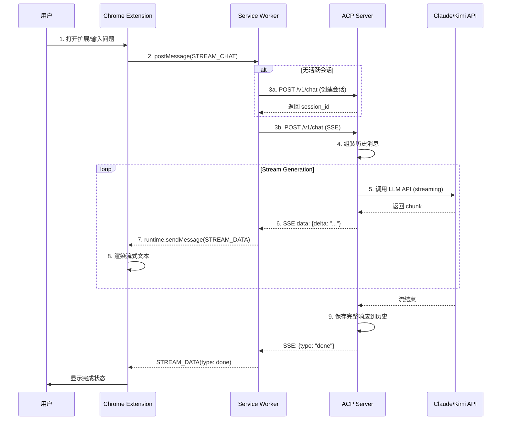

# ACP Coding Agent - 系统架构详解

## 概述

ACP (Agent Client Protocol) Coding Agent 是一个基于 **Model Context Protocol (MCP)** [^89^] 扩展的 AI 编程助手系统。它采用客户端-服务器架构，标准化了编辑器/浏览器与 AI 编程 Agent 之间的通信。

> **设计哲学**: 如同 USB-C 统一了设备连接标准，ACP 旨在成为 "AI 编程工具的 USB-C 接口" [^98^]，让不同的编辑器、IDE 和浏览器都能以统一的方式接入 AI 编程能力。

## 核心架构

### 整体架构图

```
┌─────────────────────────────────────────────────────────────────────────────┐
│                              客户端层 (Client Layer)                           │
│  ┌──────────────┐  ┌──────────────┐  ┌──────────────┐  ┌──────────────┐   │
│  │ Chrome       │  │ VS Code      │  │ Zed Editor   │  │ CLI Tool     │   │
│  │ Extension    │  │ Extension    │  │ (ACP Native) │  │              │   │
│  └──────┬───────┘  └──────┬───────┘  └──────┬───────┘  └──────┬───────┘   │
└─────────┼─────────────────┼─────────────────┼─────────────────┼───────────┘
          │                 │                 │                 │
          └─────────────────┴──────────┬──────┴─────────────────┘
                                         │
                    ┌────────────────────┴────────────────────┐
                    │           ACP Protocol (HTTP/SSE)        │
                    │    • JSON-RPC / RESTful API             │
                    │    • Server-Sent Events (流式响应)       │
                    │    • Multipart Upload (文件上传)         │
                    └────────────────────┬────────────────────┘
                                         │
┌────────────────────────────────────────┼──────────────────────────────────┐
│                         服务端层 (ACP Server)                            │
│                                          │                                 │
│  ┌───────────────────────────────────────┴─────────────────────────────┐  │
│  │                      FastAPI Application                           │  │
│  │  ┌──────────────┐  ┌──────────────┐  ┌──────────────┐              │  │
│  │  │ Router       │  │ Middleware   │  │ Background   │              │  │
│  │  │ (API 路由)    │  │ (CORS/Auth)  │  │ Tasks        │              │  │
│  │  └──────┬───────┘  └──────────────┘  └──────────────┘              │  │
│  │         │                                                          │  │
│  │  ┌──────┴──────────────────────────────────────────────────────┐  │  │
│  │  │                    Core Services                             │  │  │
│  │  │  ┌──────────────┐  ┌──────────────┐  ┌──────────────┐       │  │  │
│  │  │  │ Session      │  │ File         │  │ Context      │       │  │  │
│  │  │  │ Manager      │  │ Handler      │  │ Builder      │       │  │  │
│  │  │  │              │  │              │  │              │       │  │  │
│  │  │  │ • 多轮记忆    │  │ • 异步上传    │  │ • Prompt组装  │       │  │  │
│  │  │  │ • 上下文窗口  │  │ • 代码解析    │  │ • 历史管理    │       │  │  │
│  │  │  │ • 文件关联    │  │ • Base64编码  │  │ • 多模态融合  │       │  │  │
│  │  │  └──────────────┘  └──────────────┘  └──────────────┘       │  │  │
│  │  └────────────────────────────────────────────────────────────┘  │  │
│  │                                                                  │  │
│  │  ┌────────────────────────────────────────────────────────────┐  │  │
│  │  │                    LLM Adapter Layer                          │  │  │
│  │  │  ┌──────────────┐  ┌──────────────┐  ┌──────────────┐      │  │  │
│  │  │  │ Claude API   │  │ Kimi API     │  │ OpenAI API   │      │  │  │
│  │  │  │ (Anthropic)  │  │ (Moonshot)   │  │ (GPT-4)      │      │  │  │
│  │  │  └──────────────┘  └──────────────┘  └──────────────┘      │  │  │
│  │  │                                                              │  │  │
│  │  │  接口标准化: Unified Message Format → LLM-specific API      │  │  │
│  │  └────────────────────────────────────────────────────────────┘  │  │
│  └──────────────────────────────────────────────────────────────────┘  │
│                                                                         │
└─────────────────────────────────────────────────────────────────────────┘
```

### 数据流时序图



## 协议层详解

### ACP 协议规范

ACP 遵循 MCP (Model Context Protocol) [^89^] 的核心设计，但针对编程场景进行了扩展：

**与 MCP 的关系**:
- **MCP** 是通用协议，定义了 Resources (资源)、Tools (工具)、Prompts (提示) 三类能力 [^93^]
- **ACP** 是 MCP 在编程领域的特化实现，增加了 Diff (代码对比)、Streaming Code (流式代码) 等编程专用类型

**消息格式** (基于 JSON-RPC 2.0 [^100^]):

```json
{
  "jsonrpc": "2.0",
  "id": "uuid",
  "method": "chat",
  "params": {
    "session_id": "sess_xxx",
    "message": {
      "role": "user",
      "content": [
        {"type": "text", "text": "优化这段代码"},
        {"type": "file", "uri": "uploads/sess_xxx/main.py", "mime_type": "text/x-python"}
      ]
    },
    "stream": true
  }
}
```

### 内容块类型 (Content Blocks)

ACP 支持 MCP 标准的多模态内容块 [^81^]，并扩展编程专用类型：

| 类型 | 用途 | 来源 |
|------|------|------|
| `text` | 纯文本内容 | MCP 标准 |
| `image` | 图片 (Base64) | MCP 标准 |
| `file` | 文件引用 | MCP 标准 |
| `diff` | **代码变更对比** | ACP 扩展 |
| `tool_call` | 工具调用 | MCP 标准 |
| `tool_result` | 工具结果 | MCP 标准 |

## 核心组件

### 1. Session Manager (会话管理器)

**职责**: 维护多轮对话状态，实现上下文记忆

**关键机制**:
```python
class SessionManager:
    def __init__(self, max_history=50):
        self.sessions = {}  # 内存存储，生产环境可替换为 Redis
        self.max_history = max_history  # 上下文窗口限制

    def add_message(self, session_id, message):
        # 保留 System 消息 + 最近 N 条对话
        # 防止上下文过长导致 LLM 性能下降
```

**上下文窗口管理**:
- 总消息数限制: 默认 50 条
- 优先保留 System Prompt
- LRU 清理: 最大会话数限制 (默认 1000)

### 2. File Handler (文件处理器)

**异步架构** [^23^][^26^]:

```python
async def save_file(self, content: bytes, filename: str, session_id: str):
    # 1. 异步写入避免阻塞事件循环
    async with aiofiles.open(file_path, 'wb') as f:
        await f.write(content)

    # 2. 后台任务：代码分析
    asyncio.create_task(analyze_code_background(file_path))
```

**功能特性**:
- **流式上传**: 支持大文件分块处理 (最大 10MB)
- **自动解析**: Python/JS/Java 等代码自动提取结构
- **多模态**: 图片自动转 Base64 供 LLM 分析
- **关联管理**: 文件与会话生命周期绑定

### 3. LLM Adapter (模型适配层)

**设计模式**: 适配器模式 (Adapter Pattern)

```python
class LLMProvider(ABC):
    @abstractmethod
    async def generate(self, messages: List[Message], **kwargs) -> AsyncIterator[str]:
        pass

class ClaudeProvider(LLMProvider):
    async def generate(self, messages, **kwargs):
        # 调用 Anthropic API
        # 处理 Computer Use、Thinking 等特殊功能

class KimiProvider(LLMProvider):
    async def generate(self, messages, **kwargs):
        # 利用 Moonshot 长上下文优势 (200k)
```

**支持的模型**:
| 提供商 | 模型 | 特长 |
|--------|------|------|
| Anthropic | Claude 3.5 Sonnet | 编程能力强，Computer Use |
| Moonshot | Kimi-latest | 长上下文 (200k tokens) |
| OpenAI | GPT-4 Turbo | 综合能力 |
| Local | Ollama/LM Studio | 本地部署，隐私保护 |

### 4. Chrome Extension (浏览器扩展)

**Manifest V3 架构** [^79^]:

```
chrome-extension/
├── manifest.json          # V3 配置，声明权限和入口
├── background.js          # Service Worker (后台脚本)
│   └── SSE 连接管理、状态保持、API 转发
├── content.js            # Content Script (内容脚本)
│   └── 注入页面，抓取代码，添加悬浮按钮
└── popup/                # 用户界面
    ├── popup.html        # 聊天窗口 HTML
    ├── popup.css         # 深色模式样式
    └── popup.js          # UI 交互逻辑
```

**关键实现细节**:

1. **Service Worker 生命周期**: Manifest V3 限制 5 分钟休眠，使用 `Offscreen API` 维持 SSE 长连接

2. **跨域请求**: Chrome 扩展拥有特殊权限，可跨域访问 `localhost:8000`

3. **页面代码抓取**: 
   - GitHub: `.blob-code-inner` 选择器
   - GitLab: `.blob-content pre`
   - StackOverflow: `pre code`

## 存储架构

```
                    ┌──────────────────────┐
                    │     临时内存         │
                    │   (Python 对象)      │
                    │   • Session 对象     │
                    │   • Message 历史     │
                    └──────────┬───────────┘
                               │
          ┌────────────────────┼────────────────────┐
          │                    │                    │
          ▼                    ▼                    ▼
    ┌──────────┐        ┌──────────┐        ┌──────────┐
    │ 本地文件  │        │ 浏览器    │        │ 可选扩展  │
    │ 系统      │        │ Storage  │        │          │
    │          │        │          │        │          │
    │ • 上传的  │        │ • 扩展配置│        │ • Redis  │
    │   代码文件│        │ • 会话ID  │        │ • 向量DB  │
    │ • 图片缓存│        │ • 缓存数据│        │          │
    │          │        │          │        │          │
    │ aiofiles │        │ chrome.  │        │ (生产环境)│
    │ 异步读写  │        │ storage  │        │          │
    └──────────┘        └──────────┘        └──────────┘
```

## 部署模式

### 模式 A: 本地开发模式 (推荐个人使用)

```
Chrome Extension ─────► localhost:8000 (Python ACP Server)
                              │
                              └── ./uploads/ (本地文件)
```

**适用场景**: 个人开发、敏感代码不上云、快速迭代

### 模式 B: 远程服务模式

```
Chrome Extension ─────► https://acp.example.com
                               │
                    ┌──────────┴──────────┐
                    │   Docker/K8s 集群    │
                    │  ┌───────────────┐  │
                    │  │ ACP Server    │  │
                    │  │ (多实例)       │  │
                    │  └───────┬───────┘  │
                    │          │          │
                    │     ┌────┴────┐     │
                    │     │ Redis   │     │
                    │     │ S3/OSS  │     │
                    │     └─────────┘     │
                    └──────────────────────┘
```

**适用场景**: 团队协作、多设备同步、企业级部署

### 模式 C: 混合模式

```
代码处理 (敏感) ────────► 本地 ACP Server
                               │
LLM 调用 (通用) ────────► 远程 LLM Gateway ─────► Claude API
```

**适用场景**: 代码敏感需本地处理，但想使用云端大模型能力

## 安全性考虑

1. **文件上传**: 限制文件类型和大小 (10MB)，防止恶意文件
2. **CORS**: 生产环境应限制 `allow_origins` 为特定域名
3. **认证**: 远程部署应添加 API Key 验证
4. **代码执行**: 生成的代码在执行前应人工审核 (沙箱机制)
5. **隐私**: 本地模式确保代码不上传第三方

## 扩展性设计

### 添加新的 LLM 提供商

1. 在 `server.py` 中创建新的 Provider 类
2. 实现 `generate()` 方法的流式返回
3. 在 `stream_llm_response()` 中添加路由逻辑

### 集成其他 MCP 服务器

本 ACP 服务端可以作为 MCP Host [^95^]，连接其他 MCP Server：

```python
# 连接文件系统 MCP Server
filesystem_mcp = MCPClient("stdio", command="npx -y @modelcontextprotocol/server-filesystem /path/to/allowed/dir")

# 连接 GitHub MCP Server  
github_mcp = MCPClient("sse", url="https://github-mcp-server.example.com/sse")
```

### 多 Agent 协作

通过 `session.context` 可以支持多 Agent 工作流：

```python
# Agent A 处理代码分析
session.context["code_analysis"] = {...}

# Agent B 基于分析结果生成测试
# 从 context 读取上游 Agent 的输出
```

## 性能优化

1. **异步 I/O**: 所有文件操作使用 `aiofiles`，避免阻塞
2. **流式响应**: SSE 实时推送，首字节时间 < 500ms
3. **连接池**: HTTP 会话复用，减少 TCP 握手开销
4. **增量渲染**: Chrome 扩展逐字显示，提升 perceived performance
5. **后台分析**: 代码静态分析放入 BackgroundTask，不阻塞主响应

## 监控与调试

**内置端点**:
- `GET /v1/stats` - 服务器统计信息 (会话数、消息数)
- `GET /v1/health` - 健康检查

**日志级别**:
- `DEBUG`: 详细的消息内容、文件路径
- `INFO`: 会话创建、文件上传、API 调用
- `ERROR`: 异常堆栈

## 参考文档

- [MCP 官方文档](https://modelcontextprotocol.io/) [^95^]
- [Zed ACP 提案](https://github.com/zed-industries/zed/discussions/21614)
- [FastAPI SSE 文档](https://fastapi.tiangolo.com/advanced/streaming/)
- [Chrome Extension MV3 迁移指南](https://developer.chrome.com/docs/extensions/mv3/mv3-migration/)
