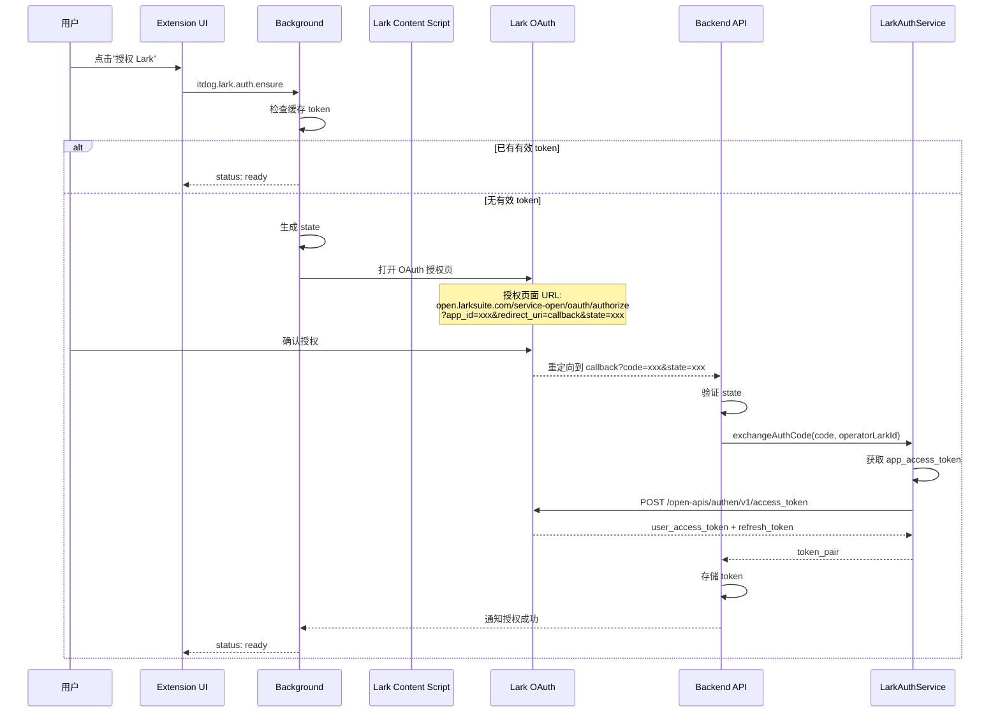
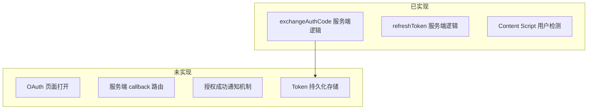
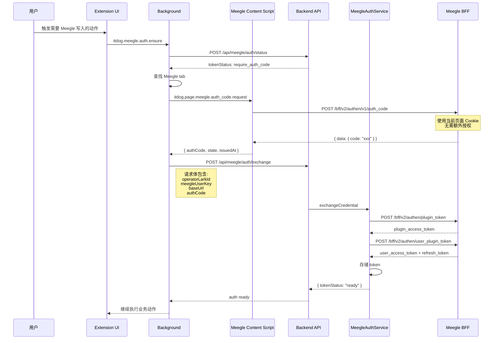
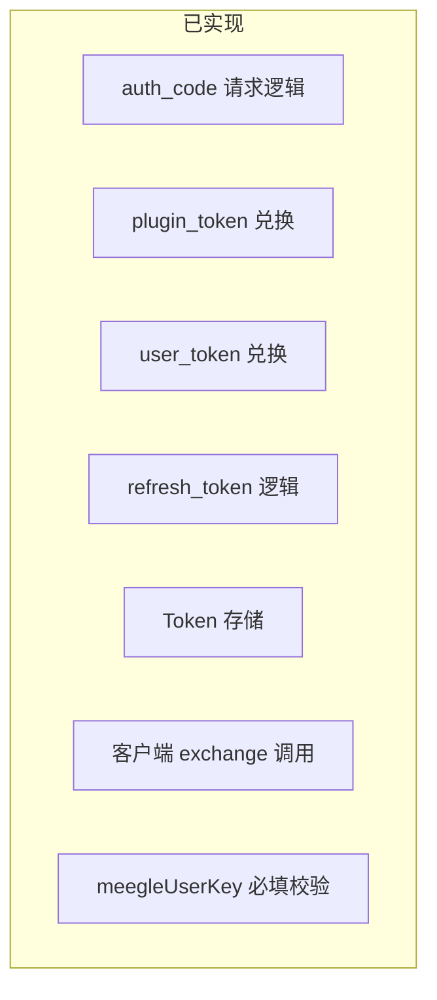

# 认证流程设计

本文档详细说明 Lark 和 Meegle 两个平台的认证流程，包括设计目标、完整流程图、当前实现状态和待修复问题。

## 1. 设计目标

### 1.1 Lark 认证目标

- 获取用户级别的 `access_token`，用于调用 Lark OpenAPI
- 支持 token 刷新机制
- 关联 `operatorLarkId` 用于身份识别

### 1.2 Meegle 认证目标

- 通过 `auth code` 换取 `user_token` 和 `refresh_token`
- 服务端缓存 token，避免重复授权
- 不暴露用户原始 Cookie 到服务端

---

## 2. Lark 认证流程

### 2.1 完整设计流程



### 2.2 组件职责

| 组件 | 职责 |
|------|------|
| Extension UI | 展示授权状态，触发授权请求 |
| Background | 管理 OAuth state，处理回调通知 |
| Content Script | 检测当前 Lark 用户 ID |
| Backend API | 提供 OAuth callback 端点，验证 state |
| LarkAuthService | 与 Lark OpenAPI 交互，token 兑换 |

### 2.3 关键 API

#### 2.3.1 服务端端点

| 端点 | 方法 | 用途 |
|------|------|------|
| `/api/lark/auth/callback` | GET | OAuth 回调地址（待实现） |
| `/api/lark/auth/exchange` | POST | 用 code 换 token |
| `/api/lark/auth/refresh` | POST | 刷新 token |
| `/api/lark/auth/status` | POST | 查询认证状态 |

#### 2.3.2 Lark OpenAPI

| 端点 | 用途 |
|------|------|
| `POST /open-apis/auth/v3/app_access_token` | 获取应用级 token |
| `POST /open-apis/authen/v1/access_token` | 用授权码换用户 token |
| `POST /open-apis/authen/v1/refresh_access_token` | 刷新用户 token |

### 2.4 当前实现状态



#### 已实现 ✅

| 文件 | 功能 |
|------|------|
| `server/src/modules/lark-auth/lark-auth.service.ts` | `exchangeLarkAuthCode`、`refreshLarkToken` |
| `server/src/modules/lark-auth/lark-auth.controller.ts` | `/exchange`、`/refresh`、`/status` 端点 |
| `extension/src/content-scripts/lark.ts` | `getLarkUserId` 用户 ID 检测 |

#### 未实现 ❌

| 问题 | 位置 | 说明 |
|------|------|------|
| OAuth 页面打开被注释 | `lark-auth.ts:149-158` | `openLarkOAuthTab` 中 `chrome.tabs.create` 被注释 |
| 缺少 callback 路由 | `server/src/index.ts` | 没有 `/api/lark/auth/callback` 端点 |
| Content Script 无法捕获回调 | `lark.ts` | OAuth 重定向到 `localhost:3000`，不在 `larksuite.com` 域 |
| Token 无持久化 | `lark-auth.service.ts` | `checkLarkAuthStatus` 返回固定值 |

### 2.5 待修复清单

1. **启用 OAuth 页面打开**
   - 取消 `openLarkOAuthTab` 中的注释
   - 确保 `redirect_uri` 指向正确的服务端 callback

2. **实现服务端 callback 路由**
   ```typescript
   app.get("/api/lark/auth/callback", async (req, res) => {
     const { code, state } = req.query;
     // 验证 state
     // 兑换 token
     // 通知 extension（可通过 storage 或 message）
     res.redirect("https://..."); // 重定向回 Lark 页面
   });
   ```

3. **设计授权成功通知机制**
   - 方案 A：使用 `chrome.storage.onChanged` 监听
   - 方案 B：使用长连接 `chrome.runtime.connect`

4. **实现 Token 持久化**
   - 参考 Meegle 的 `InMemoryMeegleTokenStore`
   - 或使用 Redis/数据库存储

---

## 3. Meegle 认证流程

### 3.1 完整设计流程



### 3.2 组件职责

| 组件 | 职责 |
|------|------|
| Extension UI | 触发认证，展示状态 |
| Background | 协调 Content Script 和服务端 |
| Meegle Content Script | 在 Meegle 页面上下文中请求 auth code |
| Backend API | 接收 auth code，完成 token 兑换 |
| MeegleAuthService | 管理 plugin_token 和 user_token |

### 3.3 关键 API

#### 3.3.1 服务端端点

| 端点 | 方法 | 用途 |
|------|------|------|
| `/api/meegle/auth/status` | POST | 查询 token 状态 |
| `/api/meegle/auth/exchange` | POST | 用 auth code 换 token |
| `/api/meegle/auth/get-code` | POST | 服务端获取 auth code（备用） |

#### 3.3.2 Meegle BFF API

| 端点 | 用途 |
|------|------|
| `POST /bff/v2/authen/plugin_token` | 用 plugin_id + plugin_secret 换 plugin_token |
| `POST /bff/v2/authen/user_plugin_token` | 用 plugin_token + auth_code 换 user_token |
| `POST /bff/v2/authen/refresh_token` | 刷新 user_token |
| `POST /bff/v2/authen/v1/auth_code` | 获取 auth code（需登录态） |

### 3.4 当前实现状态



#### 已实现 ✅

| 文件 | 功能 |
|------|------|
| `server/src/modules/meegle-auth/meegle-auth.service.ts` | 完整的 token 兑换逻辑 |
| `server/src/adapters/meegle/auth-adapter.ts` | `HttpMeegleAuthAdapter` 实现 |
| `server/src/adapters/meegle/token-store.ts` | `InMemoryMeegleTokenStore` |
| `server/src/application/services/meegle-credential.service.ts` | `exchangeCredential`、`refreshCredential` |
| `extension/src/content-scripts/meegle.ts` | `getAuthCodeFromMeegleApi` |
| `extension/src/background/handlers/meegle-auth.ts` | 客户端 exchange 调用、meegleUserKey 校验 |

#### 单元测试 ✅

| 文件 | 测试内容 |
|------|------|
| `server/src/modules/meegle-auth/meegle-auth.dto.test.ts` | DTO 验证测试 |
| `server/src/application/services/meegle-credential.service.test.ts` | token 兑换和刷新测试 |
| `server/src/adapters/meegle/auth-adapter.test.ts` | HTTP 适配器测试 |
| `extension/src/background/handlers/meegle-auth.test.ts` | 客户端认证流程测试 |

---

## 4. 两平台认证对比

| 对比项 | Lark | Meegle |
|--------|------|--------|
| 认证方式 | OAuth 2.0 授权码 | Auth Code Bridge |
| 用户感知 | 需要确认授权页面 | 无感（使用已有登录态） |
| Token 类型 | user_access_token | user_access_token |
| 刷新机制 | refresh_token | refresh_token |
| Cookie 处理 | 不涉及 | 不上传服务端 |
| 服务端完整度 | ⚠️ 缺 callback | ✅ 完整 |
| 客户端完整度 | ⚠️ OAuth 流程断裂 | ✅ 完整 |
| 单元测试 | ❌ 无 | ✅ 24 tests |
| 当前可跑通 | ❌ | ✅ |

---

## 5. 实现状态

### 5.1 Meegle 认证流程 ✅ 已完成

- 服务端完整实现 token 兑换和存储
- 客户端实现 exchange 调用
- meegleUserKey 作为必填字段校验
- 24 个单元测试全部通过

### 5.2 Lark 认证流程 ❌ 待实现

原因：
- 需要新增服务端 callback 路由
- 需要设计授权通知机制
- 需要实现 token 持久化
- 工作量较大

---

## 6. 安全边界

### 6.1 必须遵守

1. **Cookie 不上传服务端** - Meegle auth code 在客户端获取
2. **Auth code 即用即弃** - 不在客户端持久化存储
3. **Token 服务端存储** - user_token 和 refresh_token 只在服务端保存
4. **State 验证** - OAuth 和 auth code 流程都需要验证 state

### 6.2 敏感数据清单

| 数据 | 存储位置 | 传输方式 |
|------|----------|----------|
| Lark app_secret | 服务端环境变量 | 不传输 |
| Meegle plugin_secret | 服务端环境变量 | 不传输 |
| Auth code | 仅内存，即用即弃 | HTTPS |
| User token | 服务端 TokenStore | 不传输到客户端 |
| Refresh token | 服务端 TokenStore | 不传输到客户端 |