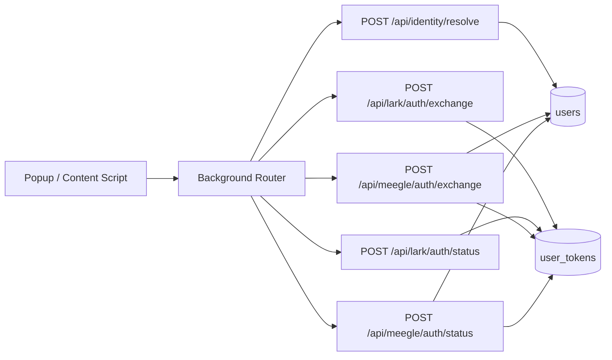
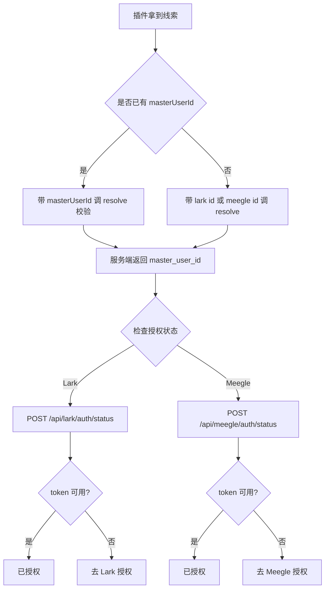
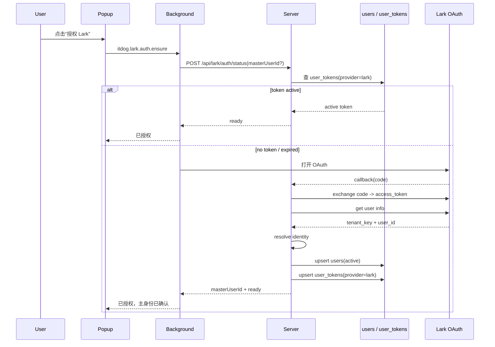
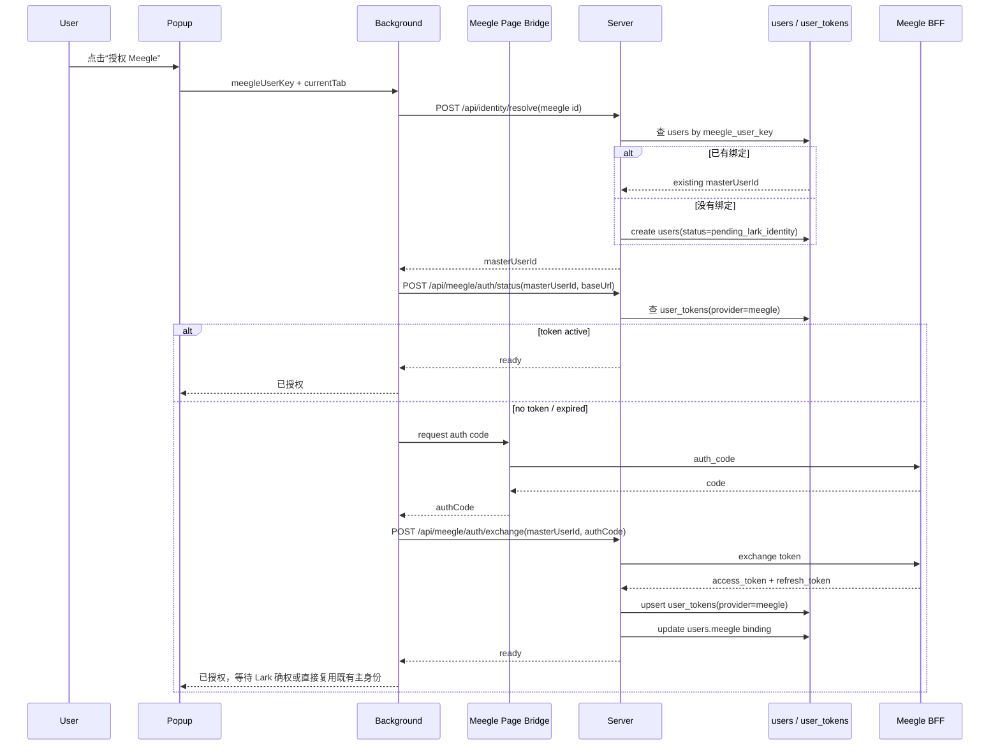
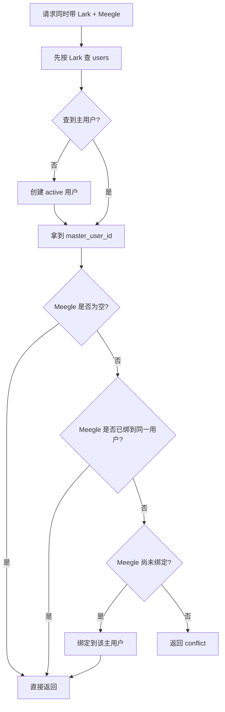

# 用户身份系统设计

## 1. 设计目标

本文档定义 Tenways Octo 的用户身份系统，解决以下问题：

- 以 `Lark 用户` 作为系统主身份
- 在只能先拿到 `Meegle 用户` 的情况下，仍然能回填并确认 `Lark 主身份`
- 插件端可以通过 `lark id` 或 `meegle id` 找到系统主用户
- 服务端统一生成并返回 `master_user_id`
- 兼容现有的 `Lark 授权` / `Meegle 授权` 按钮，不要求前端整体重写

当前阶段先按以下业务约束设计：

- 一个 `Lark 用户` 只绑定一个 `Meegle 用户`
- 一个 `Meegle 用户` 只属于一个 `Lark 用户`
- 使用一张 `users` 主表承载当前身份关系

## 2. 核心结论

### 2.1 三层身份模型

系统内同时存在 3 个身份概念：

1. `master_user_id`
   - 系统内部主键
   - 由服务端生成
   - 推荐使用 `UUIDv7` 或 `ULID`

2. `Lark 主身份`
   - 由 `lark_tenant_key + lark_user_id` 组成
   - 是“这个用户是谁”的权威依据
   - 优先级高于一切其他线索

3. `Meegle 绑定身份`
   - 由 `meegle_base_url + meegle_user_key` 组成
   - 只能用于查找已有绑定或创建待补全用户
   - 不能定义主身份

### 2.2 基本原则

- `Lark 用来定主`
- `Meegle 用来找绑定`
- `插件只提供线索，服务端负责裁决`
- `master_user_id` 永远由服务端返回，插件只缓存和复用

## 3. 为什么不用邮箱做主身份

公司邮箱只能做辅助字段，不能做主身份：

- 邮箱会变更
- 邮箱可能被回收复用
- 一个用户可能存在别名邮箱
- 某些场景下邮箱不可见或被脱敏

因此主身份不应使用邮箱，而应使用 Lark 的稳定用户标识。

## 4. 单表设计

当前阶段使用一张 `users` 表。

### 4.1 表结构

```sql
create table users (
  id varchar(64) primary key,
  status varchar(32) not null,

  lark_tenant_key varchar(128),
  lark_user_id varchar(128),
  lark_union_id varchar(128),
  lark_email varchar(256),
  lark_name varchar(256),

  meegle_base_url varchar(256),
  meegle_user_key varchar(128),
  meegle_name varchar(256),

  identity_source varchar(32) not null,
  last_seen_platform varchar(32),

  activated_at timestamp null,
  created_at timestamp not null,
  updated_at timestamp not null
);
```

### 4.2 状态定义

- `pending_lark_identity`
  - 只有 Meegle 线索，还没有权威 Lark 身份
- `active`
  - 已拿到并确认 Lark 主身份
- `conflict`
  - Lark 与 Meegle 关系冲突，不能自动合并
- `disabled`
  - 已停用，不再参与正常匹配

### 4.3 唯一约束

必须保证以下约束：

- 唯一：`(lark_tenant_key, lark_user_id)`，仅在二者非空时生效
- 唯一：`(meegle_base_url, meegle_user_key)`，仅在二者非空时生效

约束含义：

- 一个 Lark 身份只能对应一条主用户记录
- 一个 Meegle 身份只能绑定到一条主用户记录

## 5. 服务端身份解析逻辑

新增统一入口：

- `POST /api/identity/resolve`

该接口负责：

- 根据 Lark 或 Meegle 线索查找已有用户
- 必要时创建新用户
- 返回唯一的 `master_user_id`
- 在有权威 Lark 身份时激活用户
- 在发现冲突时返回 `conflict`

### 5.1 请求结构

```json
{
  "masterUserId": "optional",
  "lark": {
    "tenantKey": "optional",
    "userId": "optional"
  },
  "meegle": {
    "baseUrl": "optional",
    "userKey": "optional"
  }
}
```

### 5.2 响应结构

```json
{
  "ok": true,
  "data": {
    "masterUserId": "usr_01J...",
    "identityStatus": "pending_lark_identity"
  }
}
```

### 5.3 解析顺序

服务端按固定优先级解析：

1. 如果拿到了 `lark_tenant_key + lark_user_id`
   - 先按 Lark 主身份查找
   - 查到则直接返回对应用户
   - 查不到则创建新用户，状态直接为 `active`
   - 如果请求里同时带了 Meegle 身份，则尝试绑定
   - 如果该 Meegle 已经绑到其他用户，返回 `conflict`

2. 如果没有 Lark，只有 `meegle_base_url + meegle_user_key`
   - 先按 Meegle 绑定查找
   - 查到则返回对应用户
   - 查不到则创建新用户
   - 新用户状态为 `pending_lark_identity`

3. 如果两边都没有
   - 直接报错，不创建用户

### 5.4 重要语义

`Meegle-first` 只能创建候选用户，不能定义最终主身份。

也就是说：

- `Meegle` 可以帮助系统先建立一条用户记录
- 但只有 `Lark` 可以把这条记录升级为正式主身份

## 6. 主 ID 生成规则

`master_user_id` 由服务端生成，不由插件生成。

推荐：

- `master_user_id = UUIDv7 / ULID`

原因：

- 插件端不掌握完整身份真相
- 插件端不能作为最终身份裁决方
- 使用服务端生成的独立 ID，能支持 `pending -> active` 的渐进升级

## 7. 插件端职责

插件端不负责判定谁是主身份，只负责：

- 收集当前页面的身份线索
- 调用 `/api/identity/resolve`
- 缓存服务端返回的 `master_user_id`
- 在后续授权和业务请求中复用它

### 7.1 插件端可用线索

插件端可带给服务端的线索包括：

- 当前缓存的 `master_user_id`
- `lark_tenant_key + lark_user_id`，如果已经拿到
- 页面探测得到的 `lark id`，作为 hint
- `meegle_base_url + meegle_user_key`
- 当前页面平台、URL、会话信息

### 7.2 插件端缓存策略

插件端缓存的不是“我自己认定的用户”，而是“上次服务端认出来的用户”。

建议本地缓存：

- `masterUserId`
- `identityStatus`
- `lastResolvedLarkUserId`
- `lastResolvedMeegleUserKey`

插件端每当上下文明显变化时，仍应重新调用 `/api/identity/resolve`。

## 8. 与现有授权按钮的结合方式

现有 Popup 已经有独立的：

- `授权 Lark`
- `授权 Meegle`

这两个按钮可以保留，但语义需要调整。

### 8.1 Lark 授权按钮

新的职责：

- 获取权威 Lark 身份
- 把当前用户升级为正式主身份

推荐流程：

1. 用户点击 `授权 Lark`
2. 插件走现有 `itdog.lark.auth.ensure`
3. 服务端完成 OAuth code exchange
4. 服务端通过 Lark 用户信息接口拿到权威身份
   - `lark_tenant_key`
   - `lark_user_id`
5. 插件或服务端调用 `/api/identity/resolve`
6. 服务端返回最终 `master_user_id`
7. 插件缓存该 `master_user_id`
8. 用户状态切换为 `active`

这意味着：

- Lark 按钮不仅是“拿 token”
- 更是“确权主身份”

### 8.2 Meegle 授权按钮

新的职责：

- 获取或绑定 Meegle 侧身份
- 不能定义主身份

推荐流程：

1. 用户点击 `授权 Meegle`
2. 插件从页面取到 `meegle_user_key`
3. 插件先调用 `/api/identity/resolve`
4. 如果已有用户，则返回既有 `master_user_id`
5. 如果只有 Meegle 身份，则创建或返回 `pending_lark_identity` 用户
6. 插件再调用现有 `itdog.meegle.auth.ensure`
7. 后续 `/api/meegle/auth/exchange` 改为使用 `master_user_id`

这意味着：

- Meegle 按钮是“绑定和授权附属身份”
- 不是“决定主身份”

## 9. 现有接口调整建议

### 9.1 新增接口

- `POST /api/identity/resolve`

### 9.2 调整 Meegle 授权接口

当前 `Meegle auth exchange` 依赖 `operatorLarkId`。

建议改为：

```json
{
  "requestId": "req_xxx",
  "masterUserId": "usr_01J...",
  "meegleUserKey": "meegle_xxx",
  "baseUrl": "https://project.larksuite.com",
  "authCode": "code_xxx",
  "state": "state_xxx"
}
```

不再把 `operatorLarkId` 作为前置必填。

### 9.3 调整 Lark 授权接口语义

当前 Lark 授权阶段存在 `operatorLarkId` 过早传入的问题。

建议改成：

- Lark 授权先只做 OAuth exchange
- 在拿到权威 Lark 身份后，再进入 `resolve`
- 由服务端输出 `master_user_id`

## 10. 表与接口的整体映射

### 10.1 目标表结构

当前推荐拆成两层：

1. `users`
   - 负责身份和绑定关系
   - 回答“这个用户是谁”

2. `user_tokens`
   - 负责各 provider 的授权凭证
   - 回答“这个用户现在是否已授权”

推荐的 `user_tokens` 结构如下：

```sql
create table user_tokens (
  id varchar(64) primary key,
  master_user_id varchar(64) not null,
  provider varchar(32) not null,
  subject_key varchar(256),
  base_url varchar(256),

  access_token text,
  refresh_token text,
  token_type varchar(32),

  access_token_expires_at timestamp,
  refresh_token_expires_at timestamp,

  auth_status varchar(32) not null,
  last_auth_at timestamp,
  last_refresh_at timestamp,
  created_at timestamp not null,
  updated_at timestamp not null
);
```

### 10.2 表职责

| 表 | 作用 | 关键字段 | 典型查询 |
|------|------|------|------|
| `users` | 主身份与绑定关系 | `id`, `lark_tenant_key`, `lark_user_id`, `meegle_user_key`, `status` | 通过 `lark id` / `meegle id` 找 `master_user_id` |
| `user_tokens` | 各平台授权凭证 | `master_user_id`, `provider`, `access_token`, `refresh_token`, `auth_status` | 判断某用户对 `lark` / `meegle` 是否已授权 |

### 10.3 接口与表的关系

| 接口 | 输入 | 读表 | 写表 | 作用 |
|------|------|------|------|------|
| `POST /api/identity/resolve` | `lark id` / `meegle id` / `masterUserId` | `users` | `users` | 解析或创建主用户 |
| `POST /api/lark/auth/exchange` | `code`, `masterUserId` | `users` | `user_tokens` | 写入 Lark token |
| `POST /api/lark/auth/status` | `masterUserId` | `user_tokens` | `user_tokens` | 判断 Lark 是否已授权，必要时 refresh |
| `POST /api/meegle/auth/exchange` | `authCode`, `masterUserId`, `meegleUserKey` | `users` | `user_tokens`, `users` | 写入 Meegle token，必要时补齐绑定 |
| `POST /api/meegle/auth/status` | `masterUserId`, `baseUrl` | `user_tokens`, `users` | `user_tokens` | 判断 Meegle 是否已授权，必要时 refresh |

### 10.4 当前实现与目标实现

当前仓库里已有这些基础能力：

- 路由已经存在：
  - `/api/identity/resolve`
  - `/api/meegle/auth/exchange`
  - `/api/meegle/auth/status`
  - `/api/lark/auth/exchange`
  - `/api/lark/auth/status`
- `Meegle` 已经有独立 token store
- `resolve` 目前仍是轻量占位实现

当前数据库更接近旧模型：

- `user_identity`
  - 以 `lark_id` 为主键
- `meegle_credential`
  - 以 `operator_lark_id + meegle_user_key + base_url` 为主键

目标实现要把它收口成：

- `users`
  - 以 `master_user_id` 为主键
- `user_tokens`
  - 以 `master_user_id + provider + base_url` 管理授权态

## 11. 授权和 resolve 的整体机制图

### 11.1 组件关系图



### 11.2 状态判断图



### 11.3 Lark-first 时序



### 11.4 Meegle-first 时序



### 11.5 双边都已拿到时的 resolve 规则



## 12. 如何判断“是否已经授权”

系统里要区分两件事：

1. 是否已经绑定
   - 看 `users`

2. 是否已经授权
   - 看 `user_tokens`

### 12.1 判断绑定

- Lark 是否已确权：
  - `users.lark_tenant_key` 和 `users.lark_user_id` 是否存在
- Meegle 是否已绑定：
  - `users.meegle_base_url` 和 `users.meegle_user_key` 是否存在

### 12.2 判断授权

授权状态一律通过 status 接口判断，不直接让插件猜：

- `POST /api/lark/auth/status`
- `POST /api/meegle/auth/status`

状态判断规则：

1. `user_tokens` 里不存在记录
   - 返回 `require_auth`

2. `access_token` 未过期
   - 返回 `ready`

3. `access_token` 已过期，但 `refresh_token` 可用
   - 先 refresh
   - refresh 成功后返回 `ready`

4. `refresh_token` 也不可用
   - 更新 `auth_status = reauth_required`
   - 返回 `require_auth`

### 12.3 绑定与授权的组合关系

| 场景 | users | user_tokens | 结论 |
|------|------|------|------|
| 只有 Meegle 先到 | `pending_lark_identity` | 无 | 已识别用户，未授权 |
| Meegle 已绑定，token 有效 | 有 `meegle_user_key` | `provider=meegle, active` | Meegle 已授权 |
| Meegle 已绑定，token 过期 | 有 `meegle_user_key` | `provider=meegle, reauth_required` | 绑定仍在，但要重新授权 |
| Lark 已确权，无 token | `active` | 无 `provider=lark` | 主身份已确认，但 Lark 未授权 |
| Lark 已确权，token 有效 | `active` | `provider=lark, active` | Lark 已授权 |

## 13. 三种典型流程

### 13.1 Lark-first

1. 插件拿到 Lark 身份线索
2. 调用 `/api/identity/resolve`
3. 服务端创建或返回 `active` 用户
4. 返回 `master_user_id`
5. 后续再绑定 Meegle

### 13.2 Meegle-first

1. 插件拿到 `meegle_user_key`
2. 调用 `/api/identity/resolve`
3. 服务端创建或返回 `pending_lark_identity` 用户
4. 返回 `master_user_id`
5. 用户后续完成 Lark 授权
6. 再次调用 `/api/identity/resolve`
7. 服务端把该用户升级为 `active`

### 13.3 Both-present

1. 同时拿到 Lark 和 Meegle 身份线索
2. 服务端先按 Lark 查主用户
3. 再校验 Meegle 是否与该主用户一致
4. 一致则绑定或直接返回
5. 不一致则返回 `conflict`

## 14. 冲突处理原则

以下情况不能自动覆盖：

- 同一个 Meegle 用户试图绑定到另一个 Lark 用户
- 同一个 Lark 用户试图覆盖另一个已绑定的 Meegle 用户

此时应返回：

- `identityStatus = conflict`

并要求显式人工处理或后续设计 rebind 流程。

## 15. 当前阶段的兼容策略

目前仓库里 Lark 身份获取仍然大量依赖页面探测值。

因此现阶段可按两层身份来源运行：

1. `page_detected_lark_id`
   - 可用于前端预填、查询和初步 resolve
   - 不应视为最终权威身份

2. `oauth_verified_lark_id`
   - 来自 Lark OAuth 后的服务端确认结果
   - 是最终主身份依据

这样设计的好处是：

- 当前版本可以先落地
- 未来把 Lark 身份来源从页面探测升级到 OAuth 确认时，不需要推翻用户系统模型

## 16. 实施建议

建议按以下顺序落地：

1. 先新增 `users` 表和 `/api/identity/resolve`
2. 插件初始化时先走一次 `resolve`
3. Meegle 授权链路从 `operatorLarkId` 切到 `master_user_id`
4. Lark 授权完成后补一次 `resolve`
5. 最后再把 Lark 的最终主身份来源收敛到 OAuth 确认结果

## 17. 结论

这套设计的核心不是“插件自己知道用户是谁”，而是：

- 插件负责收集线索
- 服务端负责统一裁决
- `Lark` 决定主身份
- `Meegle` 只负责帮助定位和绑定
- `master_user_id` 是系统内唯一稳定引用

在当前“一张大表、1 对 1 绑定”的约束下，这已经是足够清晰且可演进的最小方案。
