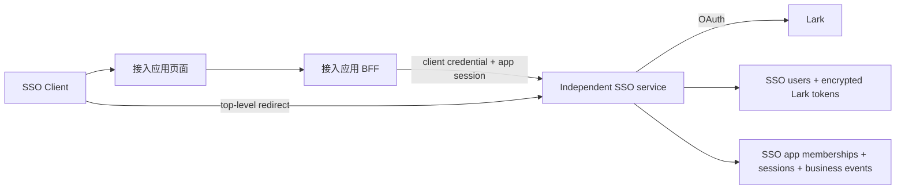
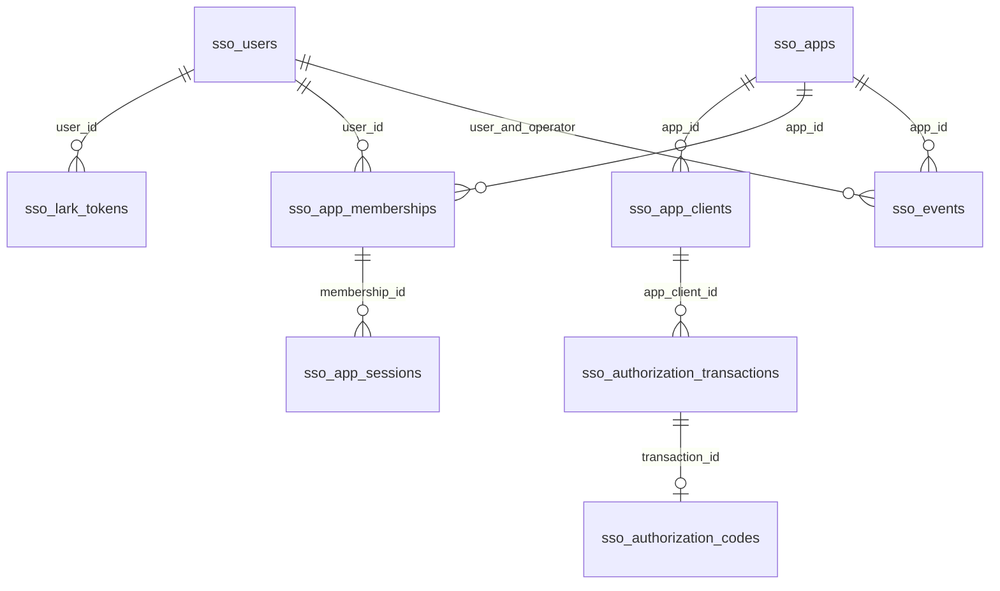
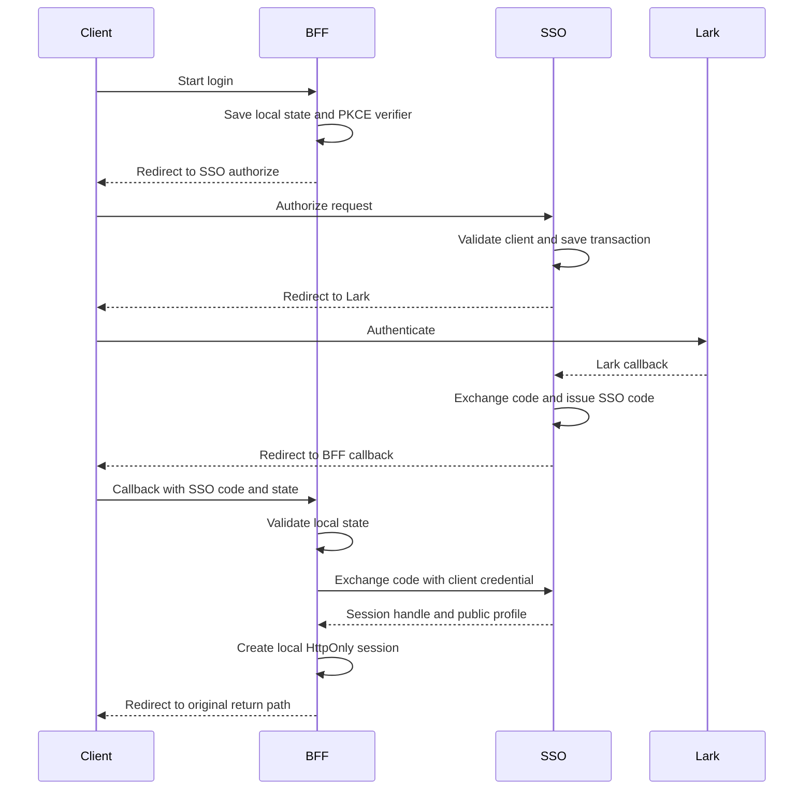
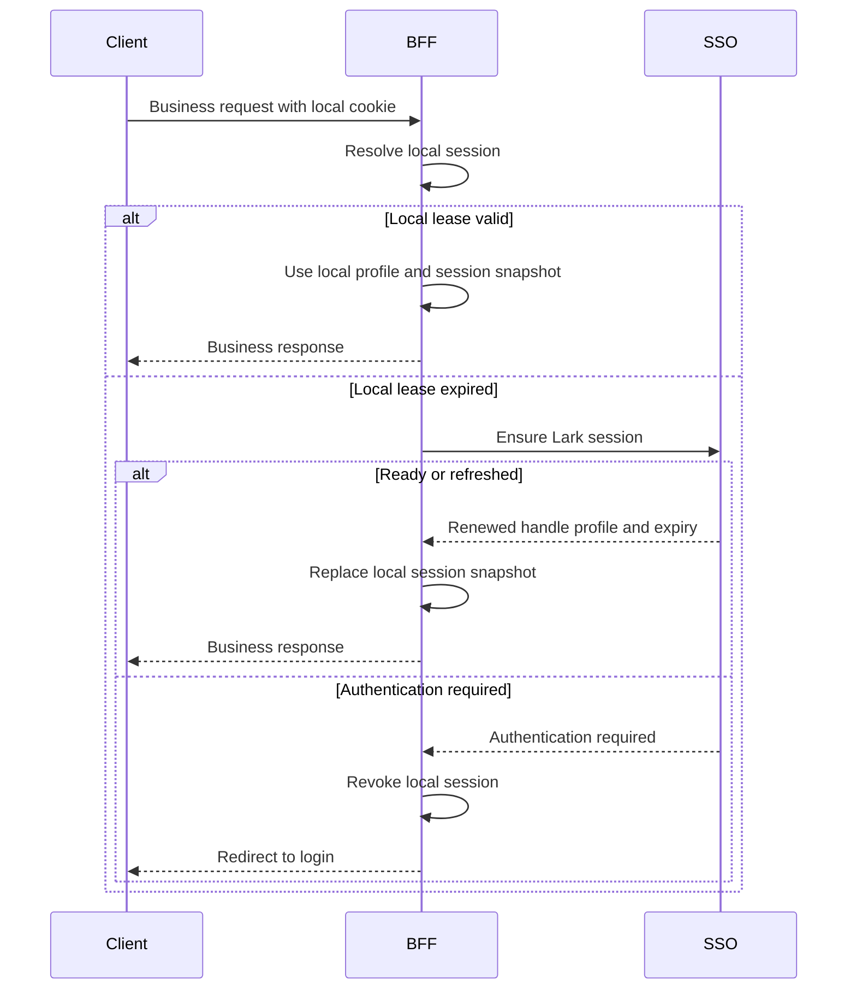

# Octo 独立 SSO 服务设计

## ADR-001：暂不由 SSO 统一 Lark 用户授权

- **状态**：已决定（2026-08-01）
- **结论**：本期不实施本设计中“SSO 持有 Lark OAuth callback、Lark token 与 refresh token”的部分。SSO 与 Lark 业务授权暂时分开；本文件后续内容仅保留为候选设计，不是当前实现契约。
- **背景**：SSO 登录只需要用户身份授权所需的最小 Lark scope，但接入应用调用 Lark 业务 API 往往需要不同、且更多的 scope。若共用一个 SSO Lark OAuth app，就会把所有接入应用的权限并集授予 SSO，导致过度授权、用户同意范围不清晰，也让任一应用的权限变更影响其他应用。
- **决定**：每个需要 Lark 业务能力的接入应用继续使用并持有自己的 Lark app、OAuth callback、scope 与 token 生命周期；SSO 不代管、不代理、不汇总这些 Lark 业务授权。Octo 现有 Lark/Meegle 授权保持独立，暂不接入 SSO。
- **重新启用条件**：只有在接入应用可以统一为一套经过审查的最小 Lark scope，并明确 token 隔离、权限变更、用户同意与回滚方案后，才重新评审并启用本文件的 SSO + Lark OAuth 设计。

## 1. 目标与边界

SSO 作为独立部署的 HTTP 服务实现，代码可以保留在 Octo 项目中，但不挂载到 Octo 主服务的 route group。它让 `octo-ml` 等浏览器应用使用 Lark 用户登录，并由 SSO 自己持有 Lark token、refresh token、用户资料、应用成员关系和业务事件日志。Octo 主服务不读取或写入这些 SSO 认证数据。

这里的多租户是 **接入 SSO 的应用多租户**：`octo-ml`、后续应用和同一应用的多个 client 都是隔离边界。它不是把 Lark 的 `tenant_key` 当成业务租户。`lark_tenant_key + lark_user_id` 仍只是识别全局 Lark 用户的稳定技术键。

### 1.1 SSO 模块负责

- 注册和鉴别接入应用及其 client。
- 发起 Lark OAuth、接收 Lark callback、交换与刷新 Lark token。
- 按 Lark 身份创建/更新全局 SSO 用户资料。
- 为用户创建应用 membership（下称 app user），并返回应用隔离的 subject、role 与启用状态。
- 签发、查询和撤销应用 session、授权码。
- 记录并查询应用范围的业务事件日志。

### 1.2 SSO 模块不负责

- 接入应用自己的业务授权策略、业务数据过滤和用户管理 UI。
- 将 Lark token、`masterUserId` 或 Lark ID 暴露给浏览器或接入应用前端。
- Meegle 用户授权、Meegle token exchange/refresh、token 存储或 Meegle API 代理；这些继续由 Octo 主服务的 Meegle 模块负责。
- 迁移或复用 Octo 既有 extension 的 `/api/lark/auth/*` 插件认证流。独立 SSO 使用自己的 Lark OAuth app 与 callback；任何 legacy 流程迁移必须另行设计，不能共享 state 或 callback dispatcher。

### 1.3 Meegle 授权边界

Meegle 是 Octo 自身业务集成，不属于 app 登录 SSO：Octo 继续持有并刷新 Meegle 用户 token，继续提供现有 `/api/meegle/auth/exchange`、`/api/meegle/auth/status` 与内部业务调用。独立 SSO 服务不保存、刷新、返回或代理 Meegle token。

SSO 向接入应用返回的是 app-scoped subject；若 Octo 的 Meegle 业务接口需要关联调用用户，Octo 在其内部按 SSO `issuer + subject` 映射到既有用户/Meegle credential。该映射只能由受保护的 Octo 内部绑定流程创建或维护，不能由 BFF 用邮箱、Lark ID 或 `masterUserId` 推断；其生命周期归 Octo 管理，不进入 SSO session 或 `sso_events`。

### 1.4 安全原则

**BFF（Backend For Frontend，面向前端的后端）** 是接入应用部署在自己同源域名下的一层服务，例如 `octo-ml` 的 Dashboard Python 服务。它接收浏览器请求并持有服务器侧的 SSO `session_handle`，再以 client credential 调用独立 SSO 服务；浏览器只持有 BFF 签发的本站 HttpOnly cookie，永远不接触 `session_handle`、client secret 或 Lark token。

1. 浏览器只持有接入应用自己的 HttpOnly cookie；页面 JavaScript 不读取它，也不读取任何 Octo/Lark 凭据。
2. 接入应用的 BFF 才能调用 `/token`、`/introspect`、`/lark/ensure`，并使用 client credential；浏览器不直接 fetch 这些接口。
3. OAuth code、PKCE verifier、app session 均为随机 opaque 值；数据库只保存 hash。
4. 邮箱仅是展示资料，不能用于匹配登录身份或授予权限。
5. 跨应用不共享 app session、role 或业务事件读取权限。

## 2. 架构与身份模型



`sso_users` 是全局身份和资料的 canonical store；`sso_app_memberships` 是用户在一个接入应用中的身份、role 和状态。对外 subject 必须按 `(app, client, user)` 派生，不能返回 `sso_users.id`、`masterUserId`、Lark ID 或 token。

### 2.1 应用隔离

| 概念 | 作用 | 是否跨应用共享 |
| --- | --- | --- |
| Lark identity | 查找/创建 SSO 全局用户 | 是，仅在 SSO 内部 |
| `sso_users` profile | 姓名、邮箱、头像 | 是，仅在 SSO 内部 |
| app membership / role | 用户在某应用中的访问状态 | 否 |
| authorization code | 一次授权结果 | 否，绑定 client/app/redirect URI |
| app session | BFF 的当前用户会话凭据 | 否，绑定 client/app/user |
| business event | 某应用的成功登录或 app user 状态变更 | 否 |

## 3. 数据模型

SSO 使用独立数据库（或至少独立 schema 和独立数据库账号）创建下列全部表。它不读取或写入 Octo 主服务的 `users`、`user_tokens`、`oauth_sessions` 或 `lark_contacts`；也不接管它们的 Lark callback。SSO 的 Lark OAuth app、callback URL 和 token 加密密钥必须独立配置。

### 3.0 `sso_users` 与 `sso_lark_tokens`

| 表 | 字段 | 类型 | 说明 |
| --- | --- | --- | --- |
| `sso_users` | `id` | `uuid` | SSO 内部主键，不对 app 暴露。 |
|  | `lark_tenant_key`, `lark_user_id` | `text` | Lark 全局稳定身份；`UNIQUE(lark_tenant_key, lark_user_id)`。 |
|  | `name`, `email`, `avatar_url` | `text NULL` | 每次成功 Lark callback 同步的公开资料。邮箱只作展示。 |
|  | `created_at`, `updated_at` | `timestamptz` | 创建与资料同步时间。 |
| `sso_lark_tokens` | `id`, `user_id` | `uuid` | 主键与 `sso_users.id` 外键。 |
|  | `lark_base_url` | `text` | SSO 配置并规范化的 Lark/Feishu API base URL；不接受 app 传入。 |
|  | `access_token_ciphertext`, `refresh_token_ciphertext` | `bytea` | 使用 SSO 独立 AEAD key 加密保存；绝不返回给 app 或浏览器。 |
|  | `access_token_expires_at`, `refresh_token_expires_at`, `updated_at` | `timestamptz` | `ensure` 判断与刷新所需时间。 |

`sso_lark_tokens` 使用 `UNIQUE(user_id, lark_base_url)`。同一用户的 refresh 必须按 `user_id + lark_base_url` 加锁，成功后在同一记录更新密文和到期时间；不以“最近一条 token”作降级选择。



#### 表职责总览

| 表 | 类型 | 作用 |
| --- | --- | --- |
| `sso_users` | 新增 | SSO 的全局 Lark 身份及公开资料权威。 |
| `sso_lark_tokens` | 新增 | SSO 独占的加密 Lark access/refresh token 与到期时间。 |
| `sso_apps` | 新增 | 接入 SSO 的逻辑应用边界；隔离 membership、业务事件和管理范围。 |
| `sso_app_clients` | 新增 | 某 app 的 OAuth client 凭据、单一 redirect URI 与启用状态。 |
| `sso_app_memberships` | 新增 | app user 关系：用户在某 app 的 role 与 `status`。 |
| `sso_authorization_transactions` | 新增 | 从 `/authorize` 发起到 Lark callback 完成期间的 state、PKCE 与回跳上下文。 |
| `sso_authorization_codes` | 新增 | callback 交给接入端 BFF 的短时、一次性 authorization code。 |
| `sso_app_sessions` | 新增 | 发给 BFF 的 SSO app session handle 的 hash、lease 与撤销状态。 |
| `sso_events` | 新增 | app 范围的业务事件：成功登录与 app user 状态实际变更。 |

所有 SSO 表必须使用外键和唯一约束保证关系完整性。Octo 既有认证表不属于本服务的 migration 或运行期依赖。

### 3.1 `sso_apps`

| 字段 | 类型 | 说明 |
| --- | --- | --- |
| `id` | `uuid` | 主键 |
| `app_key` | `text` | 稳定、唯一的应用键，例如 `octo-ml` |
| `display_name` | `text` | 管理与日志展示名 |
| `status` | `text` | `active` / `disabled`，默认 `active` |
| `created_at`, `updated_at` | `timestamptz` | 记录创建、更新时间 |

### 3.2 `sso_app_clients`

| 字段 | 类型 | 说明 |
| --- | --- | --- |
| `id` | `uuid` | 内部 client 记录主键 |
| `app_id` | `uuid` | 所属应用的外键 |
| `client_id` | `text` | OAuth 对外标识，唯一；只用于 `/authorize`、`/token` 的 client authentication 查找 |
| `client_secret_hash` | `text` | 只保存 Argon2/bcrypt hash，不保存明文 secret |
| `redirect_uri` | `text NULL` | 精确允许的单一 callback URI；draft client 可暂时为空 |
| `status` | `text` | `active` / `disabled`，默认 `disabled`；只有已配置 callback URI 的 client 可启用 |
| `created_at`, `updated_at` | `timestamptz` | 记录创建、更新时间 |

一个 app 可有多个 client（如蓝绿迁移中的旧/新 BFF、不同受信任 callback 域名）；每个 client 只能归属一个 app。它们共享该 app 的 membership role/status。若 test/prod 需要独立开关或 role，必须注册为两个 `sso_apps`，而不是同一 app 下的两个 client。除 `client_id` 的唯一约束外，增加 `UNIQUE (id, app_id)`，供后续 app/client 复合外键校验。不提供面向浏览器或接入应用的公开注册 HTTP 接口；仅提供受运维凭据保护的 operator API。

#### 服务端 app/client 注册

由 Octo 运维环境执行 `server/src/scripts/sso-app.ts` 的受控 CLI，或调用等价的 operator API；两者必须复用同一个 service，不允许各自实现写表逻辑。下列命令名和接口是本期实现契约，实际 CLI 部署命令由项目 package script 包装。日常操作不允许直接写表；紧急维护 SQL 也必须复用相同的 hash、唯一约束与状态约束。

| 操作 | CLI | operator API | 输入 | 服务端写入与输出 |
| --- | --- | --- | --- | --- |
| 创建 app | `create-app` | `POST /api/sso/operator/apps` | `app_key`、`display_name` | 在单一事务内生成 `sso_apps.id`，写入 `status='active'`；输出 app key 与内部 UUID，不产生 client secret。相同 `app_key` 返回冲突，不做隐式更新。 |
| 创建 client | `create-client` | `POST /api/sso/operator/apps/:app_key/clients` | 可选精确 `redirect_uri` | 生成内部 client UUID、对外随机 `client_id` 和至少 256-bit 随机 `client_secret`；仅保存 `client_secret_hash`，响应中**只返回一次**明文 secret。未提供 URI 时创建 `disabled` draft client。 |
| 设置 client URI | `set-client-redirect-uri` | `PATCH /api/sso/operator/clients/:client_id` | `redirect_uri` | 校验并更新 URI；不自动启用 client，需显式设置 status 为 `active`。 |
| 轮换 client secret | `rotate-client-secret` | `POST /api/sso/operator/clients/:client_id/rotate-secret` | 无 | 生成新 secret 并原子替换 hash；响应中只返回一次新 secret。部署端更新配置后才能继续调用 token/introspect/ensure。 |
| 开关 app/client | `set-app-status` / `set-client-status` | `PATCH /api/sso/operator/apps/:app_key` / `PATCH /api/sso/operator/clients/:client_id` | `status: active | disabled` | 更新对应 status；不物理删除历史记录。 |

operator API 一律要求 `Authorization: Bearer <SSO_ADMIN_API_TOKEN>`，并应只在内部网络或管理网关后暴露；它不能使用 app client credential、app user session 或浏览器 cookie 鉴权。`set-client-redirect-uri`（以及带 URI 的 `create-client`）必须校验 redirect URI 为 HTTPS、无 fragment，且与 app BFF 的实际 callback 完全一致；生产环境不得接受 loopback 或通配符 URI。`redirect_uri IS NULL` 的 draft client 以及 `status='disabled'` 的 client 不能调用 `/authorize`、`/token`、`/introspect` 或 `/lark/ensure`。client secret 不写控制台以外的持久日志、数据库明文字段或 `sso_events`。app/client 注册、URI 设置与 secret 轮换不是 app user 管理操作，因此不写 `sso_events`。

### 3.3 `sso_app_memberships`

| 字段 | 类型 | 说明 |
| --- | --- | --- |
| `id` | `uuid` | 主键 |
| `app_id` | `uuid` | 所属应用；与 `user_id` 唯一组合 |
| `user_id` | `uuid` | `sso_users.id` 的外键 |
| `role` | `text NULL` | 可空字符串；`role.includes("admin")` 为管理员 |
| `status` | `text` | 既有 `active` / `disabled`；默认 `active`，控制该 app user 是否可登录、续租与使用该 app |
| `created_at`, `updated_at` | `timestamptz` | 记录创建、更新时间 |

首次用户完成某 app 的 OAuth 时自动创建 `status = 'active'` 的 membership，`role = null`。之后的登录只更新 `sso_users` profile，不覆盖已有 role 或 `status`。已被关闭的 app user 不会因 Lark 登录自动重新启用。

### 3.4 `sso_authorization_transactions`

| 字段 | 类型 | 说明 |
| --- | --- | --- |
| `id` | `uuid` | 服务端生成的 transaction ID |
| `lark_state_hash` | `text` | Lark callback state 的 SHA-256；raw state 只在 OAuth 跳转与 callback query 中传输，不持久化、不写日志 |
| `app_id`, `app_client_id` | `uuid` | 目标应用和内部 client 记录；由外部 `client_id` 查得 |
| `redirect_uri` | `text` | 必须等于 client 注册值 |
| `client_state_ciphertext` | `bytea` | 接入端原 state 的加密副本；仅成功/可安全回传的失败时原样回传，不解释为身份 |
| `code_challenge`, `code_challenge_method` | `text` | 仅允许 `S256` |
| `lark_base_url` | `text` | 服务端从 `SSO_LARK_BASE_URL` 规范化后写入；callback exchange 使用此值 |
| `status` | `text` | `pending` / `processing` / `completed` / `failed` / `expired` |
| `callback_claimed_at`, `expires_at` | `timestamptz` | callback 原子 claim 时间；`expires_at` 默认 10 分钟，过期不得交换 code |
| `user_id` | `uuid NULL` | callback 完成后的 SSO 用户；不构成业务事件 |
| `failure_code`, `request_id` | `text NULL` | callback 完成后的安全结果与内部关联 ID；不构成业务事件 |

SSO state 生成格式为 `sso.<256-bit-random>`；收到 callback 后计算 hash 查此表。前缀只帮助排障，真正的授权依据是持久化事务记录。

维护任务将过期的 `pending` transaction 标记为 `expired`，将超过 `SSO_CALLBACK_PROCESSING_TIMEOUT_SECONDS` 的 `processing` transaction 标记为 `failed`。`processing` 不回退为 `pending`，避免 Lark authorization code 被重复交换；用户重新发起 OAuth 才能得到新的 transaction。

### 3.5 `sso_authorization_codes`

| 字段 | 类型 | 说明 |
| --- | --- | --- |
| `id` | `uuid` | 主键 |
| `code_hash` | `text` | code 仅回传一次，数据库只存 hash |
| `transaction_id` | `uuid` | 唯一外键，指向产生该 code 的 authorization transaction |
| `expires_at` | `timestamptz` | 由服务端 `SSO_AUTHORIZATION_CODE_TTL_SECONDS` 计算 |
| `consumed_at` | `timestamptz NULL` | 原子消费时间 |

code 的 app、client、user、redirect URI 与 PKCE challenge 均从 `transaction_id` 的父记录读取；`/token` 通过原子 join 消费 code，不能接收或覆盖这些绑定值。

### 3.6 `sso_app_sessions`

| 字段 | 类型 | 说明 |
| --- | --- | --- |
| `id` | `uuid` | 主键 |
| `session_hash` | `text` | 仅保存 BFF 持有的 app session handle hash |
| `app_id`, `app_client_id`, `membership_id` | `uuid` | 绑定 app/client/membership |
| `user_id` | `uuid` | 绑定 `sso_users` 用户 |
| `subject` | `text` | 对 `client_id + sso_users.id` 用 `SSO_SUBJECT_HMAC_KEY` 派生的稳定 pseudonym；同一 client/user 在新 session 中保持不变，跨 client 不同 |
| `lark_base_url` | `text` | 此 session 续租时精确定位 `sso_lark_tokens` 行 |
| `issued_at`, `renewed_at`, `expires_at` | `timestamptz` | 固定 lease 的签发/续租/到期时间；业务访问不滑动延长 lease |
| `revoked_at`, `revoke_reason` | `timestamptz NULL`, `text NULL` | 会话撤销时间与原因 |

### 3.7 `sso_events`

`sso_events` 是 app 范围内的**业务事件日志**。首版只允许两类事件：成功登录和 app user 状态变更。表只追加、不更新、不删除单条记录；建议默认保留 180 天，由显式的维护任务按 `SSO_BUSINESS_EVENT_RETENTION_DAYS` 清理。

| 字段 | 类型 | 说明 |
| --- | --- | --- |
| `id` | `uuid` | 事件唯一 ID |
| `occurred_at` | `timestamptz` | 发生时间 |
| `app_id` | `uuid` | 所属接入应用 |
| `event_type` | `text` | `login_succeeded` 或 `app_user_status_changed` |
| `user_id` | `uuid` | 登录用户，或被开关的目标 app user；非空 |
| `operator_user_id` | `uuid NULL` | 仅 `app_user_status_changed` 时填写执行管理员；登录事件为 `NULL` |
| `status` | `text NULL` | 仅 `app_user_status_changed` 时填写结果 `active` / `disabled`；登录事件为 `NULL` |

约束：`event_type='login_succeeded'` 时 `operator_user_id IS NULL AND status IS NULL`；`event_type='app_user_status_changed'` 时 `operator_user_id IS NOT NULL AND status IN ('active', 'disabled')`。

仅以下动作写入事件：

1. `POST /api/sso/token` **成功原子消费 authorization code 并创建 app session 的同一事务内**写 `login_succeeded`，填 app、user 和发生时间。
2. 管理员 app-user 开关接口使 `status` **实际变化后**写 `app_user_status_changed`，填 app、目标 user、操作人和结果 status。

重复提交相同 status、`/authorize`、Lark callback、`/introspect`、`/lark/ensure`、session 撤销、token refresh、登录失败和查询都不写 `sso_events`。它们只进入必要的脱敏服务日志。严禁写入 OAuth `code`、`state`、PKCE verifier、client secret、cookie、Lark token、refresh token、IP、user-agent、原始 Authorization header 或 session handle。

### 3.8 新 SSO 表的外键与唯一约束

| 子表 | 必须的关系约束 |
| --- | --- |
| `sso_apps` | `app_key` 唯一；`status NOT NULL DEFAULT 'active' CHECK (status IN ('active', 'disabled'))` |
| `sso_app_clients` | `app_id → sso_apps.id`；对外 `client_id` 唯一；`status NOT NULL DEFAULT 'disabled' CHECK (status IN ('active', 'disabled'))`；`CHECK (status = 'disabled' OR redirect_uri IS NOT NULL)`；`(id, app_id)` 唯一，供 `app_client_id` 复合引用 |
| `sso_lark_tokens` | `user_id → sso_users.id`；`UNIQUE(user_id, lark_base_url)`；token 密文与 key-id 均不得出现在业务事件或响应中 |
| `sso_app_memberships` | `app_id → sso_apps.id`、`user_id → sso_users.id`；`UNIQUE(app_id, user_id)`；`status NOT NULL DEFAULT 'active' CHECK (status IN ('active', 'disabled'))`；增加 `(id, app_id, user_id)` 唯一组合，供 session 复合引用 |
| `sso_authorization_transactions` | `(app_client_id, app_id) → sso_app_clients(id, app_id)`；完成后 `user_id → sso_users.id`；`lark_state_hash` 唯一；`status` 仅允许 `pending` / `processing` / `completed` / `failed` / `expired` |
| `sso_authorization_codes` | `transaction_id → sso_authorization_transactions.id` 且 `UNIQUE(transaction_id)`；`code_hash` 唯一。app/client/user/redirect/PKCE 从 transaction 继承，不能由 token 请求提供 |
| `sso_app_sessions` | `(membership_id, app_id, user_id) → sso_app_memberships(id, app_id, user_id)`；`(app_client_id, app_id) → sso_app_clients(id, app_id)`；`session_hash` 唯一 |
| `sso_events` | `(app_id, user_id)` 指向 `sso_app_memberships(app_id, user_id)`；`(app_id, operator_user_id)` 在非空时指向同表；检查约束限定两类 `event_type` 的字段组合；业务事件记录只能追加 |

所有 app/user/client 冗余列仅为查询与历史索引保留，必须由上述复合外键约束为同一条父链，不能仅靠 service 层比对。应用和 client 使用 `status=disabled` 禁用，不物理删除，避免破坏业务事件历史与 session。

## 4. HTTP 接口

所有 JSON 成功响应为 `{ ok: true, data }`；失败响应为 `{ ok: false, error: { errorCode, errorMessage, requestId } }`。DTO 使用 Zod 校验，控制器仅负责校验和响应，授权/状态机放在 `sso.service.ts`。

### 4.1 `GET /api/sso/authorize`

SSO Client 顶层导航接口。参数：

| 参数 | 要求 |
| --- | --- |
| `response_type` | 固定 `code` |
| `client_id` | 已启用 client |
| `redirect_uri` | 与注册值精确一致 |
| `state` | 接入端生成的不透明值，1–2048 字符 |
| `code_challenge` | S256 PKCE challenge |
| `code_challenge_method` | 固定 `S256` |

行为：

1. 校验 client、redirect URI、PKCE 与参数。
2. 保存 SSO authorization transaction，302 到 Lark authorize URL。Lark callback 一律回到独立 SSO 服务配置的 `https://<sso-host>/api/lark/auth/callback`；它只处理本服务自己的 transaction，不查询或分发 Octo legacy state。
3. 接入 BFF 仅在没有本地 session，或 lease 到期后的 `ensure` 返回 `LARK_AUTH_REQUIRED` / session invalid 时发起 `/authorize`；单纯 lease 到期必须先走 `ensure`。
4. 参数错误或 client 被禁用时，返回安全错误页/400，不跳转到未登记地址。

### 4.2 `GET /api/lark/auth/callback`

这是独立 SSO 服务在其**自身 Lark OAuth app** 中登记的唯一 callback URL，仅由 Lark 顶层 redirect 调用。入口按 `state` 的 hash 查 `sso_authorization_transactions`；不会读取 Octo 主服务的 `oauth_sessions`，也不会作为 extension callback dispatcher。校验 transaction 后，服务使用 transaction 的 `lark_base_url` 交换 code、获取 Lark user info，并按 `(lark_tenant_key, lark_user_id)` upsert `sso_users` 的 name/email/avatar；创建或读取 target app membership。仅在 membership `status='active'` 时保存加密 Lark token、签发 authorization code，并 302 到已登记的接入端 callback。若已存在的 membership `status='disabled'`，返回固定 `SSO_APP_USER_DISABLED`；不得因 Lark OAuth 自动重新开启。

对已识别的 SSO transaction，Lark 拒绝、身份冲突、token 交换失败只写脱敏服务日志；未知、过期或已消费 state 同样只写脱敏安全日志。它们都不能产生 app 业务事件。响应和日志均不含敏感原文。

#### 状态归属：不同 app 不共享 callback 上下文

| 状态对象 | 保存位置与所有者 | 关键关联 | 用途 |
| --- | --- | --- | --- |
| app login transaction | 接入 app BFF 自己的数据库 | `client_state`、PKCE verifier、站内 `return_path` | 证明 app callback 是自己发起的；BFF 在 callback 验证后才可调用 `/token` |
| SSO authorization transaction | SSO `sso_authorization_transactions` | `lark_state_hash`、app/client、注册 redirect URI、加密 `client_state`、PKCE challenge | 将 Lark callback 精确归属到一个 app/client；决定成功后唯一允许的跳转地址 |
| SSO authorization code | SSO `sso_authorization_codes` | app/client/user、redirect URI、PKCE challenge | 在 SSO callback 与 app BFF `/token` 之间一次性安全交接 |

`client_state` 与发给 Lark 的 `lark_state` 是两个不同值：前者属于 app BFF，最终原样回到 app；后者属于独立 SSO，只用于定位和消费 Lark callback transaction。任何 app 都不能读取或复用另一个 app 的 transaction、code 或 session。

独立服务只读取 `sso_authorization_transactions`（app/client、注册 redirect URI、PKCE、加密 client state），由 Lark user info 按 `(lark_tenant_key, lark_user_id)` upsert SSO user，再处理该 transaction 的 membership/token。Octo legacy callback 的状态、handler 和错误页不在此部署内。

#### SSO callback 的原子状态机与后续动作

1. `/authorize` 验证 `client_id` 与 `redirect_uri` 后，创建 pending transaction；原 app state、PKCE challenge、app/client 和 redirect URI 都只由这一步写入。
2. Lark callback 抵达时，用 `UPDATE ... WHERE lark_state_hash = ? AND status = 'pending' AND expires_at > now() RETURNING ...` 原子 claim transaction 为 `processing`。未 claim 到时不交换 Lark code，也不签发新 code；若 Lark 已返回 provider error，则在 claim 后直接标记 `failed`，不调用 token exchange。
3. SSO handler 使用 claim 返回的 **数据库字段**（而不是 callback query）调用 Lark、upsert `sso_users`、查/建 `(app_id, user_id)` membership；若已存在 membership 的 `status='disabled'`，标记 transaction 失败并停止，不保存 token、不签发 code。
4. 同一数据库事务内创建 `sso_authorization_codes`、将 transaction 标记 `completed`。authorization code 绑定 transaction 的 app/client、redirect URI、PKCE challenge 与 user；此时尚未创建 app session，也不写业务事件。
5. 仅在完成后，302 到 transaction 的 `redirect_uri`，附加新 SSO code 和解密的原 client state。BFF 仍须用自己的登录 transaction 校验该 client state，再调用 `/token`。
6. Lark 拒绝或失败时，已识别且仍可信的 transaction 才能 302 回其保存的 redirect URI，并携带固定错误码与原 client state；未知/过期/重复 state 一律返回通用错误页，不重定向。
7. 若进程在 `processing` 中断，维护任务按超时将 transaction 终结为 `failed`；不得重新 claim 或重复交换同一个 Lark code，BFF 必须发起新的 `/authorize`。

这样独立 SSO 的同一 Lark callback URL 可以服务多个 app：app 归属来自 SSO transaction，用户归属来自 Lark identity，回跳地址来自已注册且持久化的 redirect URI。任何一个 callback 都不能用另一个 app 的 client、redirect URI、PKCE verifier 或 authorization code 完成 `/token`。

### 4.3 `POST /api/sso/token`

只允许接入应用 BFF 调用。使用 HTTP Basic client authentication：`Authorization: Basic base64(client_id:client_secret)`。

请求：

```json
{
  "grant_type": "authorization_code",
  "code": "opaque-one-time-code",
  "redirect_uri": "https://ml.example.com/api/auth/callback",
  "code_verifier": "pkce-verifier"
}
```

服务端原子校验 code 未过期/未消费、client/app/redirect URI、`code_verifier` 与目标 membership 的 `status='active'`，从其 parent transaction 继承 `lark_base_url` 创建 app session 后返回。若 app user 在 callback 与 `/token` 之间被关闭，code 必须被消费为失败，返回 `SSO_APP_USER_DISABLED`，不能在之后重新开启时复用。code 的 TTL 由 Octo 配置决定，token 请求或浏览器参数不能延长它：

```json
{
  "ok": true,
  "data": {
    "session_handle": "opaque-app-session-handle",
    "issuer": "https://sso.example.com",
    "subject": "client-isolated-subject",
    "expires_at": "2026-07-27T12:00:00Z",
    "is_admin": true,
    "user": {
      "name": "Lin",
      "email": "lin@example.com",
      "avatar_url": "https://...",
      "role": "admin"
    }
  }
}
```

`session_handle` 仅可由 BFF 加密/受限持久化，不能发送给浏览器；返回中没有 `masterUserId`、Lark ID、access token 或 refresh token。

### 4.4 `POST /api/sso/introspect`

仅允许 BFF，使用同一 client authentication。请求为 `{ "session_handle": "..." }`。服务端验证 session、client、app、membership `status='active'` 与撤销状态：未到 `expires_at` 时返回 canonical `issuer`、当前公开 profile、role、`is_admin`、`expires_at`；达到 `expires_at` 时返回 `SSO_SESSION_RENEWAL_REQUIRED`，不得放行业务。该接口用于接入端主动核验或诊断，不是每次业务请求的必经调用。

### 4.5 `POST /api/sso/lark/ensure`

仅允许 BFF，使用同一 client authentication 和 app session handle。未被撤销、且 membership `status='active'` 的 session 在到期前后都可调用；若已到期，它只能用于续租，不能先放行业务。服务端先从 `sso_lark_tokens` 确认 refresh token 仍可用，再判断 access token 是否需要刷新。行为：

- refresh token 缺失/过期：撤销该 app session，返回 `LARK_AUTH_REQUIRED`，即使 access token 尚未到期也不续租；不写业务事件；
- refresh token 有效且 access token 尚有效：返回 `ready`，轮换 `session_handle` 并分配新的固定 lease；
- refresh token 有效但 access token 过期：按用户加锁刷新、持久化，再轮换 handle 并分配新的固定 lease；不写业务事件；
- refresh 调用失败：撤销该 app session，返回 `LARK_AUTH_REQUIRED`；不写业务事件。

`ensure` 成功响应包含 canonical `issuer`、轮换后的 `session_handle`、公开 profile、role、`is_admin` 与新的 `expires_at`，避免接入端紧接一次重复 `introspect`。`introspect` 不隐式刷新 Lark token。

### 4.6 `GET /api/sso/admin/events`

应用业务事件查询接口，仅 BFF 调用。使用 client authentication 和 app session handle；服务端要求 session 所属 membership `status='active'`，且 `role?.includes("admin")`。

查询参数：`event_type`（可选 `login_succeeded` / `app_user_status_changed`）、`from`、`to`、`user_query`、`cursor`、`limit`（最大 100）。app 范围由 client/session 决定，**不接受调用方指定 app id/key**。

返回登录时间或状态变更时间、app 展示名、目标用户公开资料；状态变更事件额外返回操作人公开资料和结果 `status`。不得返回 session handle、token 或其他敏感字段。普通成员、跨 app handle、`status='disabled'` membership 返回 `SSO_ADMIN_REQUIRED`/403。

### 4.7 `PATCH /api/sso/admin/app-users/:subject`

app user 开启/关闭接口，仅 BFF 调用。请求 body 为 `{ "status": "active" | "disabled" }`；`:subject` 必须是当前 client 作用域中的稳定 pseudonym，不接受 `sso_users.id`、Lark ID、邮箱或跨 client subject。

服务端在同一数据库事务内执行：

1. 用 client authentication 和调用方 `session_handle` 验证调用方 session 未撤销、未过期、其 membership `status='active'`，且 `role?.includes("admin")`。
2. 按当前 app/client 解析 target `subject`，只允许操作同一 app 的 app user；调用方不能关闭自己，避免失去最后一个可用管理入口。
3. 若目标状态已相同，返回 `{ changed: false }`，不写日志、不撤销 session。
4. 若状态变化，更新 target membership 的 `status` 和 `updated_at`，追加一条 `sso_events(event_type='app_user_status_changed')`；返回 `{ subject, status, changed: true }`。
5. 关闭（`'disabled'`）时，同一事务撤销该 membership 的全部未撤销 app session，`revoke_reason = 'app_user_disabled'`；开启（`'active'`）不复活旧 session，用户必须重新完成登录以获得新 session。

该接口不触碰 Lark token；它只会在状态实际变化时写 `sso_events`，不会创建登录事件。SSO 内部 session 会立即撤销；但在固定 lease 模型下，接入端已签发且尚未到期的本地 session 最迟在 TTL（默认两小时）内停止使用，除非后续增加撤销推送/denylist。

### 4.8 Operator app/client 管理接口

这一组接口仅供 Octo 运维自动化或受保护的管理网关调用；它们统一使用 `Authorization: Bearer <SSO_ADMIN_API_TOKEN>`。该 token 与 app client secret、`session_handle` 和 app user 管理权限完全隔离。所有成功响应仍使用 `{ ok: true, data }`；client secret 仅在 create/rotate 的本次响应 `data.client_secret` 中出现一次，响应不得被应用日志、代理或监控系统记录。

| 接口 | 请求 body | 成功响应要点 | 约束 |
| --- | --- | --- | --- |
| `POST /api/sso/operator/apps` | `{ app_key, display_name }` | app 的 `id`、`app_key`、`display_name`、`status` | `app_key` 重复返回 `SSO_APP_KEY_CONFLICT`；不创建 client。 |
| `POST /api/sso/operator/apps/:app_key/clients` | `{ redirect_uri?: string }` | client 的 `id`、`client_id`、`client_secret`、`redirect_uri`、`status` | 无 URI 时为 `disabled` draft；有 URI 时仍默认 disabled，需单独启用。 |
| `PATCH /api/sso/operator/apps/:app_key` | `{ status: "active" | "disabled" }` | 更新后的 app | 不删除 app；禁用传播遵循固定 lease 的 TTL 边界。 |
| `PATCH /api/sso/operator/clients/:client_id` | `{ redirect_uri?: string, status?: "active" | "disabled" }` | 更新后的 client（不含 secret） | `status='active'` 时必须已有有效 redirect URI；同时更新 URI 与启用时先校验 URI，再原子更新。 |
| `POST /api/sso/operator/clients/:client_id/rotate-secret` | 无 | `client_id`、一次性 `client_secret` | 原子替换 secret hash；旧 secret 立即失效。 |

这组接口不写 `sso_events`。它们必须做 request body schema 校验、常量时间比较 operator token，并为所有响应设置 `Cache-Control: no-store`；涉及 secret 的响应还必须设置 `Pragma: no-cache`。

### 4.9 接口汇总与协作关系

`authorization code` 是一次性数据，不是独立 HTTP 接口：它由 `/authorize` 发起的流程在 Lark callback 成功后签发，只能由 BFF 通过 `/token` 消费。

| 接口 / 数据 | 调用方 | 何时调用 | 输入凭据 | 是否改变状态 | 输出 / 下一步 |
| --- | --- | --- | --- | --- | --- |
| `GET /api/sso/authorize` | SSO Client 顶层跳转 | 无本地可续租 session，或 Lark refresh 无法续租后 | client id、注册 redirect URI、state、PKCE challenge | 创建 authorization transaction | 跳转 Lark；完成后向 app callback 带回 `code` |
| `GET /api/lark/auth/callback` | Lark | 用户完成/拒绝 Lark OAuth 后 | Lark code 或拒绝错误、SSO state | 处理 SSO transaction；成功时交换/保存 token、同步用户资料、签发 SSO authorization code；失败时记录固定错误码 | 302 到接入端 callback 或安全错误页 |
| `authorization code` | SSO → 接入端 BFF callback | 仅上述 callback 后 | 短时、一次性、不透明 code | 仅可被原子消费一次 | BFF 携带它调用 `/token` |
| `POST /api/sso/token` | 接入端 BFF | 仅首次登录或重新 OAuth 后 | client credential、code、PKCE verifier | 消费 code，创建固定 lease app session | `issuer`、`session_handle`、公开 profile/role、`expires_at` |
| `POST /api/sso/introspect` | 接入端 BFF | 主动核验、诊断或恢复本地状态时；非日常请求必经项 | client credential、session handle | 否；不 refresh、不续租 | `issuer`、当前 profile/role/expiry，或 `SSO_SESSION_RENEWAL_REQUIRED` / invalid |
| `POST /api/sso/lark/ensure` | 接入端 BFF | app session lease 到期后；也可由 BFF 显式提前续租 | client credential、session handle | 是；必要时 refresh Lark token，轮换 handle，分配新 lease | `issuer`、新 handle、公开 profile/role、`expires_at`，或 `LARK_AUTH_REQUIRED` |
| `GET /api/sso/admin/events` | 管理员 BFF | 管理页查询本 app 业务事件 | client credential、admin session handle、可选 event type | 否 | 当前 app 范围内分页业务事件 |
| `PATCH /api/sso/admin/app-users/:subject` | 管理员 BFF | 开启或关闭本 app user | client credential、admin session handle、target subject、`status` | 是；更新 membership，关闭时撤销 target sessions，并写 `app_user_status_changed` 事件 | `changed`、target subject、最终 `status` |
| `POST /api/sso/operator/apps` 等 5 个接口 | Octo 运维自动化 / 管理网关 | 注册、配置、开关 app/client，或轮换 secret | `SSO_ADMIN_API_TOKEN` | 是；不写业务事件 | app/client 配置；create/rotate 仅本次返回 secret |

固定 lease 下的主链路为：`authorize → code → token → 本地使用至 expires_at → ensure → 新 lease`。`introspect` 只用于按需查询，不能代替 `ensure` 来续租或 refresh Lark token。

## 5. 登录与接入流程

### 5.1 无本地可续租 session 时建立登录



### 5.2 已登录与固定 lease 续租



## 6. Session 控制

### 6.1 SSO app session

- `session_handle` 为 256-bit random opaque secret，必须绑定 app/client/user/membership，数据库只存 hash。
- 仅 BFF 使用，调用 `introspect`/`lark/ensure` 时还必须同时通过 client authentication；不能作为浏览器 cookie、URL 参数或 JS 可读值。
- 生命周期：固定 lease，不随读取或业务请求滑动续期。`expires_at` 到达后不能再访问业务，必须用 `lark/ensure` 重新分配 lease；app user 关闭、app/client 禁用、Lark refresh 失败或管理员主动撤销时，SSO 立即标记撤销。
- `subject` 为稳定的 client-isolated pseudonym；关闭 app user 时通过同一事务更新其全部未撤销 session 的 `revoked_at` 与 `revoke_reason`，不依赖 session version。
- `expires_at = min(now + SSO_APP_SESSION_TTL_SECONDS, user_access_token_expires_at - SSO_LARK_EXPIRY_SAFETY_WINDOW_SECONDS)`；因此 lease 不会越过已知 access token 到期点。
- session 到期后的第一请求只能走 `lark/ensure`：refresh token 有效且 access token 有效则直接续租；refresh token 有效但 access token 已过期则静默 refresh 后续租；refresh token 不可用则进入 Lark OAuth。续租成功必须轮换 `session_handle`，避免长期复用旧 handle。

### 6.2 固定 lease 续租状态机

app session 不是 Lark token 的副本；它是“最近一次 Lark token 检查后授予的、最长为 `SSO_APP_SESSION_TTL_SECONDS` 的本地使用许可”。在 lease 内，接入端完全本地验证，不与 SSO 交互；lease 到期才续租。

由于新 lease 的 `expires_at` 不晚于已知 access token 的到期安全窗口，用户持续使用也不能无限延长本地登录态。refresh token 在上一次 lease 后失效时，最迟会在下一次 lease 到期续租时被发现；最大检测延迟不超过 app session TTL。

接入端在有效 lease 内不联系 SSO，因此 app user 关闭、membership/client 禁用、角色变更和管理员撤销对已签发 lease 的最大传播延迟同样是 app session TTL（默认 2 小时）。若将来需要即时切断，另行增加 SSO → 接入端的撤销事件/denylist；本期不以轮询换取即时性。

#### Lease 与 Lark token 的组合

| app session lease | access token | refresh token | 处理 |
| --- | --- | --- | --- |
| 未到 `expires_at` | 有效 | 有效 | octo-ml 本地验证并执行业务，不调用 SSO。 |
| 已到 `expires_at` | 有效 | 有效 | BFF 调用 `ensure`；SSO 轮换 `session_handle`，分配新的固定 lease。 |
| 已到 `expires_at` | 已过期 | 有效 | BFF 调用 `ensure`；SSO 静默 refresh Lark token，更新 token 时间，轮换 handle，并分配新 lease。 |
| 已到 `expires_at` | 有效或已过期 | 已过期 | 不续租；接入端清除本地登录态，重新走 Lark OAuth，由 Lark 决定是否需要用户再次登录或授权。 |
| 未到 `expires_at` | 已过期 | 任意 | 正常情况下不应发生：创建 lease 时已限制 `expires_at` 不晚于 access token 到期安全窗口；如发生时钟偏差或异常，BFF 必须立即进入 `ensure`，不得继续放行业务。 |

| 状态 | 条件 | 接入端可做什么 | 服务端动作 |
| --- | --- | --- | --- |
| `active` | 未到 `expires_at`，且未撤销 | 正常使用 | 接入端本地放行业务；可选 `introspect` 返回 profile/role |
| `renewal_required` | 已到 `expires_at`，但 client/membership 未撤销 | 只可调用 `lark/ensure`，不得放行业务 | 用保存的 `user_id` 检查/refresh Lark token；成功后轮换 handle、分配新 lease |
| `ready_after_ensure` | refresh token 有效且 access 有效，或 refresh 成功 | 继续使用 | 返回新 handle、profile/role、`expires_at`；不写业务事件 |
| `revoked` | token/refresh 不可用，或 client/membership/session 被撤销 | 清除本地登录态并重新登录 | 在 session 写撤销原因，返回 `LARK_AUTH_REQUIRED` 或 `SSO_SESSION_INVALID`；不写业务事件 |

`lark/ensure` 可以为到期但未撤销的 session 分配新 lease，但不能让已经 `revoked` 的 session 复活。

### 6.3 接入应用 session

接入端（例如 octo-ml）必须再建立自己的随机 HttpOnly cookie。其数据库保存 cookie hash、SSO `session_handle`、公开 profile snapshot、`expires_at`、`last_renewed_at` 和 revoked 状态；不保存 Lark token。

- 接入端所有业务 API 先验证本地 session 与其镜像的 `expires_at`。未到期时直接使用本地公开 profile/session snapshot，不调用 SSO。
- 到期后，本地 cookie 只可用于请求 BFF 的续租动作；BFF 不得直接执行业务 API，必须先向 SSO 调用 `lark/ensure` 并保存其轮换后的 handle、profile 与 `expires_at`。
- POST、DELETE、导出和 Lark-dependent 操作在有效 lease 内与读取相同；lease 到期且 SSO 不可用时一律失败关闭。
- SSO 返回 `LARK_AUTH_REQUIRED` 或 session invalid 时，接入端撤销本地 session 并将用户导向自己的登录页；下一次登录重新走 Lark OAuth。浏览器不自行刷新 token，也不依赖 Octo 的第二套 browser session。

## 7. 模块与改动布局

```text
sso-server/src/
  index.ts                    # 独立 HTTP listener；不导入 Octo 主服务 router
  modules/sso/
  sso.dto.ts
  sso.controller.ts
  sso.service.ts
  sso.controller.test.ts
  sso.service.test.ts
  adapters/postgres/
  sso-app-store.ts
  sso-authorization-store.ts
  sso-membership-store.ts
  sso-session-store.ts
  sso-event-store.ts
  sso-user-store.ts
  sso-lark-token-store.ts
  adapters/lark/
    lark-oauth-client.ts
  http/
  sso-routes.ts
  adapters/postgres/database.ts
  adapters/postgres/schema.ts
  scripts/sso-app.ts          # operator API 的受控 CLI 封装
```

`sso.service.ts` 负责授权 transaction、SSO 身份 upsert、membership、session、业务事件和错误码；底层 Lark HTTP 逻辑留在 adapter。独立服务可复用无状态的 HTTP client 代码，但不复用 Octo 的 token store、callback router、session 表或 OAuth 配置。

## 8. 配置与运维

| 配置 | 含义 |
| --- | --- |
| `SSO_APP_SESSION_TTL_SECONDS` | 固定 app session lease；默认 `7200`（2 小时），不随请求滑动续期 |
| `SSO_LARK_EXPIRY_SAFETY_WINDOW_SECONDS` | Lark token 到期前的复验安全窗口；默认 `60` |
| `SSO_AUTHORIZATION_CODE_TTL_SECONDS` | 授权码有效期；默认 `60`，建议保持在 `30–120` 秒 |
| `SSO_CALLBACK_PROCESSING_TIMEOUT_SECONDS` | 已 claim 的 callback 最大处理时间；默认 `120`，超时后终结 transaction，要求重新 OAuth |
| `SSO_BUSINESS_EVENT_RETENTION_DAYS` | 业务事件的保留天数；默认 `180` |
| `SSO_STATE_ENCRYPTION_KEY` | 仅 SSO 使用的 32-byte AEAD 密钥；加密 `client_state_ciphertext`，生产必须配置 |
| `SSO_TOKEN_ENCRYPTION_KEY` | 仅 SSO 使用的独立 32-byte AEAD 密钥；加密 `sso_lark_tokens` 的 access/refresh token，生产必须配置，不能与 state key 复用 |
| `SSO_SUBJECT_HMAC_KEY` | 仅 SSO 使用的 HMAC key；按 `client_id + sso_users.id` 派生稳定且 client-isolated 的对外 subject，生产不得轮换或须配套 subject 迁移 |
| `SSO_ADMIN_API_TOKEN` | operator app/client 管理接口的独立 Bearer 凭据；生产必须配置，不能与 client secret 或 Lark 凭据复用 |
| `SSO_PUBLIC_BASE_URL` | 独立服务的公开 HTTPS base URL；也是返回身份的 canonical `issuer` |
| `SSO_LARK_BASE_URL` | SSO 唯一允许使用的 Lark/Feishu OAuth base URL；服务端规范化后写入 transaction/session，并定位 `sso_lark_tokens` |
| `SSO_LARK_APP_ID`, `SSO_LARK_APP_SECRET` | 仅独立 SSO 使用的 Lark OAuth 凭据；不与 Octo 主服务凭据复用 |
| `SSO_LARK_OAUTH_CALLBACK_URL` | 固定为 `${SSO_PUBLIC_BASE_URL}/api/lark/auth/callback`，并在 SSO 自己的 Lark OAuth app 登记 |

生产必须使用 HTTPS；app client secret 仅出现在创建/轮换时和接入端 BFF 安全配置中。server 日志遵循现有 redaction 规则，并额外覆盖 `code_verifier`、`session_handle`、`client_secret`。

## 9. 验收与测试

### 单元与 mock integration

1. client、redirect URI、PKCE 和授权码只能在所属 app/client 中使用，重复/过期兑换失败。
2. 新 Lark 用户自动创建全局 user 与目标 app membership（`status='active'`）；第二个 app 创建独立 membership；role 与启用状态不串用。
3. 同一用户资料在后续登录更新，但 membership role 与 `status` 不被覆盖；关闭的 app user 不能因 Lark OAuth 自动重新开启。
4. refresh token 有效且 access token 有效时 `ensure=ready`；access 过期时只刷新一次；refresh token 缺失、过期或刷新失败时 app session 被撤销，即使 access token 尚未到期也不续租。上述 ensure 结果不新增业务事件。
5. app session lease 到期后不放行业务；refresh/access 均有效时 `ensure` 轮换 handle 并分配新 lease，access 过期且 refresh 有效时静默 refresh 后续租，refresh 不可用时重新 Lark OAuth。已签发 lease 的撤销传播延迟不超过 TTL。
6. `POST /token` 成功创建 session 时，`sso_events` 仅新增一条 `login_succeeded`；失败登录、callback、refresh、撤销均不新增事件，且业务事件/服务日志均不含 code、cookie、token 或 secret。
7. admin 可用本 client scope 的 `subject` 开启/关闭同 app user；不能跨 app/client、不能关闭自己。状态变化时更新 `status`、关闭目标全部 session 并只新增一条 `app_user_status_changed`；重复状态请求不写事件。关闭后 callback/token/ensure 均拒绝，重新开启不复活旧 session。
8. `admin` membership 可按 `event_type` 查询本 app 的 `sso_events`；普通成员、跨 app session、伪造 handle 均为 403。
9. SSO 的 `/api/lark/auth/callback` 只能按 state hash 命中自己的 transaction；未知、过期、provider rejection、已 claim/处理超时、跨 app/client/redirect URI/PKCE 的 state 或 code 均失败，且绝不查询 Octo legacy `oauth_sessions`。
10. 同一 `sso_users.id` 存在多个 Lark base URL 记录时，SSO 只能使用与 user 和 session `lark_base_url` 精确匹配的 `sso_lark_tokens` 行；不得按更新时间或仅按 user 选取 token。
11. operator API 缺失/错误 token 均拒绝且不写库；create/rotate 的响应只在本次带明文 secret、数据库仅存 hash；draft client 不能启用或调用 SSO 接口直到有效 redirect URI 已设置；关闭 app/client 不写 `sso_events`。
12. SSO 的路由、表与 token store 不读取或写入 Meegle credential；Octo 的 Meegle exchange/status/refresh 与业务调用通过受保护的 `issuer + subject` 内部映射继续运行。

### 接入端契约测试

以 fake SSO server 验证接入应用使用 authorize/token/ensure（以及可选 introspect）：前端不直接触达 SSO 的 credential 接口，用户资料与 role 来自 token/ensure 响应；有效 lease 内无需 SSO 调用，到期后 SSO 不可用则不执行任何业务请求。

### 真实联调

在受控环境验证一次 Lark callback、自动 refresh、跨应用同用户登录和管理员业务事件查询。mock 测试不得宣称替代真实 Lark OAuth 验证。

## 10. 非目标

- 本期不提供 app 自助注册、角色管理 UI、跨 app 管理员、logout-all UI、SSO browser session 或接入端业务事件页面。
- 本期不以邮箱、浏览器 localStorage、插件 `masterUserId` 或现有插件 cookie 作为 SSO 凭据。
- 本期不迁移现有 extension 认证流；它继续由 Octo 主服务独立维护。若要迁移，必须另行设计身份迁移、兼容与回滚，不能与本服务共用 callback/state/token store。
